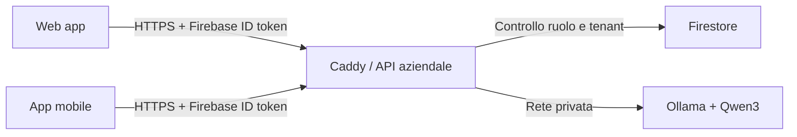

# RadioTech — AI centrale, prevenzione e supporto alla squadra

## Funzioni disponibili su web e mobile

- **AI e previsioni**: incarichi attivi/scaduti, asset prioritari, motivazioni degli indicatori, ricerca e data preventiva stimata quando esistono almeno tre completamenti di interventi approvati con intervalli validi. Il web offre anche l'esportazione CSV.
- **Chat aziendale**: conversazione libera per tutti gli utenti abilitati del tenant, via API autenticata. Non occorrono account AI personali o installazioni sui telefoni. La cronologia resta in memoria nell'interfaccia e viene cancellata al logout/chiusura; non viene salvata nel database dal servizio chat.
- **Turni e pause**: inizio turno, pausa, ripresa e fine, disponibilità dichiarata e promemoria dopo 90 minuti; i responsabili vedono gli stati della squadra e le registrazioni non aggiornate. Registrazione volontaria, senza posizione continua e senza certificazione delle presenze.
- **Segnalazioni**: pericoli, quasi incidenti e richieste di supporto; l'operatore vede le proprie, i responsabili del tenant prendono in carico e risolvono con nota. Queste funzioni richiedono rete attiva; non simulano la registrazione quando il server non risponde. Non costituiscono un servizio di emergenza monitorato.

Gli stati hanno versioni e le modifiche ai turni/segnalazioni hanno identificatori di operazione per evitare aggiornamenti concorrenti e duplicazione delle stesse richieste. Le transizioni amministrative sono registrate nell'audit senza copiare la descrizione delle richieste di supporto.

## Accesso da qualsiasi sede



Il modello è centrale: gli utenti raggiungono soltanto l'origin HTTPS dell'applicazione. La porta Ollama non viene pubblicata; la chiave Firebase e l'URL pubblico sono configurati sul backend. Il mobile usa lo stesso origin compilato nel rilascio. Un singolo servizio può servire più tenant con i controlli già presenti, senza conversazioni condivise.

Il modello locale non applica tariffe per singola richiesta; hosting, GPU/CPU, memoria, traffico e manutenzione hanno costi. Non viene promesso un servizio cloud pubblico gratuito, illimitato o con SLA senza un hosting disponibile. Il progetto `gestionale-radio` ha `billingEnabled=false` alla verifica del 3 ottobre 2026: non è stato possibile pubblicare un servizio Google Cloud usando questo progetto.

## Deploy autoconfigurante su server Docker

Compilare `.env.production` dal modello con Firebase, origin HTTPS, CORS e due secret indipendenti secondo [DEPLOYMENT.md](DEPLOYMENT.md); impostare `FIREBASE_CREDENTIALS_FILE` con un file esterno. Sul server Docker:

```powershell
.\scripts\start-enterprise.ps1
```

Su Linux:

```bash
docker compose -f compose.yaml -f compose.enterprise.yaml config --quiet
docker compose -f compose.yaml -f compose.enterprise.yaml up --build -d --wait --wait-timeout 1800
```

L'override enterprise abilita la chat, avvia Ollama `0.35.1`, scarica automaticamente `qwen3:4b`, esegue il riscaldamento del modello e avvia l'API dopo l'inizializzazione. Il volume dei modelli è persistente; `OLLAMA_KEEP_ALIVE=-1` mantiene il modello caricato. Il primo avvio richiede accesso al registry e spazio per il download. Il servizio modello ha limiti di 8 GiB/4 CPU; dimensionare il server per modello, API e picchi effettivi. Questi limiti non sono una garanzia di prestazioni: misurare latenza, memoria e capacità sull'hardware di produzione e predisporre monitoraggio.

Per GPU aggiungere la configurazione NVIDIA compatibile con il server prima del rollout. Non esporre Ollama direttamente a Internet. Configurare DNS/Caddy/TLS e l'origin effettivo; eseguire `scripts/verify-release.ps1` e le prove autenticate web/mobile. La build Docker/Compose è un gate CI, non ancora eseguito localmente perché Docker è assente in questa workstation.

Un provider Ollama aziendale già disponibile si può configurare con `RADIOTECH_AI_ENABLED=true`, `RADIOTECH_OLLAMA_URL` e `RADIOTECH_AI_MODEL`, senza override Compose. Non inviare dati a un endpoint pubblico non controllato dall'azienda.

## Sicurezza, dati e attendibilità

- La chat limita input, cronologia, risposte del provider, timeout, redirect e concorrenza. Sono ammesse 12 richieste/minuto per identità e due generazioni simultanee per istanza; oltre il limite restituisce 429. Un modello indisponibile restituisce 503. Non esegue tool, query arbitrarie o modifiche ai documenti.
- Il contesto operativo è disattivato inizialmente. Se abilitato include aggregati e al massimo dieci evidenze di rischio autorizzate; esclude nomi dei dipendenti, token, report grezzi, turni e segnalazioni di benessere. Gli operatori ricevono soltanto analisi dei propri incarichi e asset associati. La politica/logging del server Ollama e la retention dell'infrastruttura vanno configurate separatamente.
- I nuovi documenti workforce sono accessibili soltanto tramite il backend: le regole client Firestore ne negano accesso diretto, anche ai manager. Non inserire diagnosi nei campi di supporto. Definire con l'azienda tempi di conservazione, accessi e procedure di cancellazione delle registrazioni personali prima dell'uso reale.
- Pubblicare gli indici aggiunti in `firestore.indexes.json` prima del rilascio. Gli emulatori non verificano il requisito degli indici compositi di produzione.
- Attivare TTL su `workforceOperations.expiresAt` per la retention degli identificatori idempotenti: `gcloud firestore fields ttls update expiresAt --collection-group=workforceOperations --enable-ttl --project=gestionale-radio`. Il retry idempotente è garantito entro la retention; i controlli di versione restano attivi dopo la scadenza. Non impostare cancellazioni automatiche dei segnali/turni senza la retention concordata. [Riferimento ufficiale CLI TTL](https://docs.cloud.google.com/sdk/gcloud/reference/firestore/fields/ttls/update).

L'analisi `EXPLAINABLE_RULES_V1` usa stato asset, ROS, temperatura, incarichi scaduti e ricorrenza di interventi approvati. La data stimata usa la mediana degli intervalli storici. Sono indicatori di triage e previsione degli intervalli di manutenzione, **non probabilità calibrate di guasto** o un modello ML addestrato. Soglie e interventi vanno verificati con il costruttore e il responsabile tecnico; i dati mancanti e i campioni parziali sono segnalati. Per un modello di guasto validato servono telemetria datata, eventi di guasto etichettati e validazione sullo storico aziendale.

L'analisi legge al massimo 500 documenti per collezione, cento asset nel caso personale; il campione non è un censimento globale. I turni mostrano al massimo 250 registrazioni e le segnalazioni le cento più recenti. Espandere la capacità con paginazione/materializzazione e limiti condivisi prima di applicare requisiti oltre queste soglie.

## Verifica eseguita

Ollama `0.35.1` e `qwen3:4b` sono stati verificati realmente sul computer di sviluppo. Il test Java autentica un'identità di prova e chiama il provider reale; non sostituisce il rollout HTTPS su hosting pubblico. È stato osservato anche un caricamento iniziale lento: il deploy include warm-up e memoria persistente per evitarlo nel normale utilizzo.

Le nuove prove coprono scope personale, isolamento tenant, transizioni/versioni, retry idempotenti, privacy del contesto, input/risposte del modello, escaping della chat, viewport mobile e rendering Flutter. Per ripetere il test del modello reale:

```powershell
$env:RADIOTECH_AI_SMOKE_TEST='true'
.\gradlew.bat test --tests 'com.radiotech.radiotech_backend.service.AiConversationServiceTest' --no-daemon
```

Riferimenti: [API ufficiale Ollama](https://docs.ollama.com/api/chat), [release Ollama 0.35.1](https://github.com/ollama/ollama/releases/tag/v0.35.1), [licenza e progetto Qwen3](https://github.com/QwenLM/Qwen3). I modelli Qwen3 open-weight sono distribuiti con licenza Apache 2.0; conservare le relative note di licenza nel pacchetto distribuito.
