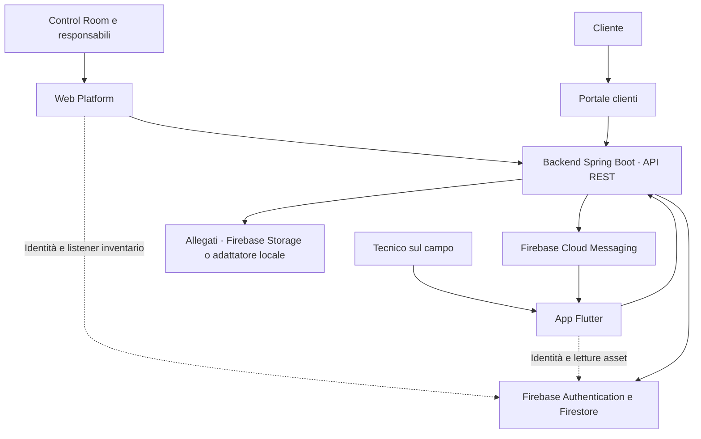
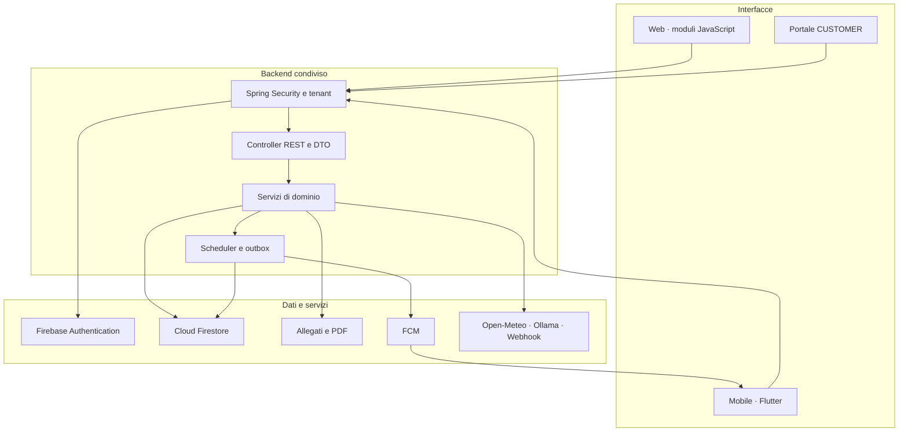
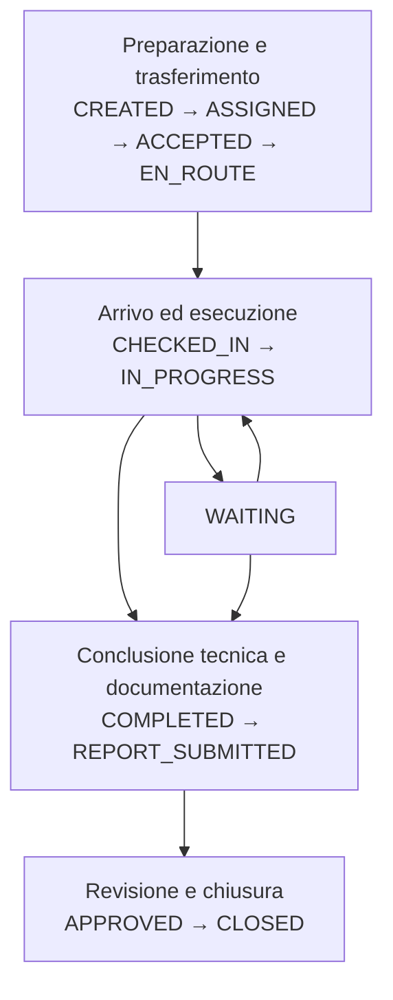
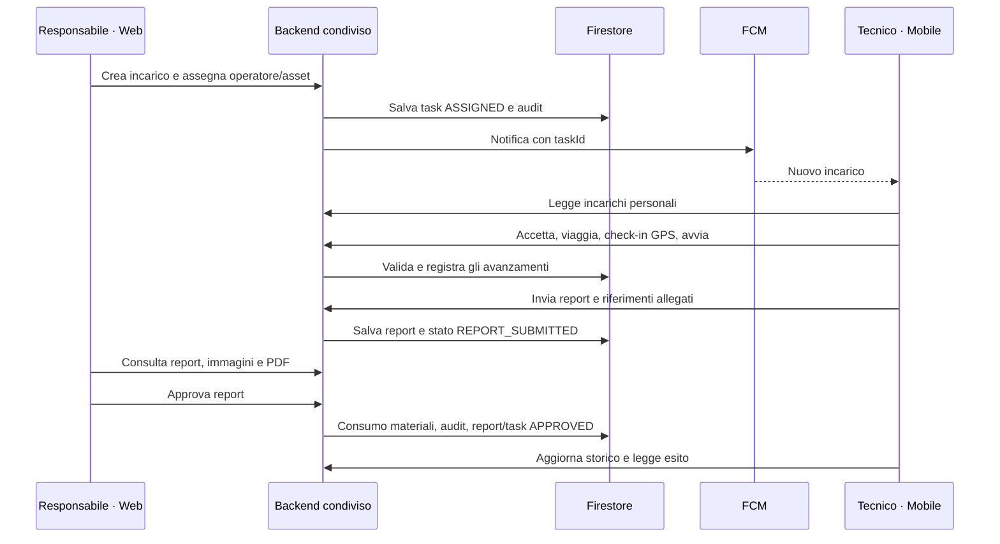
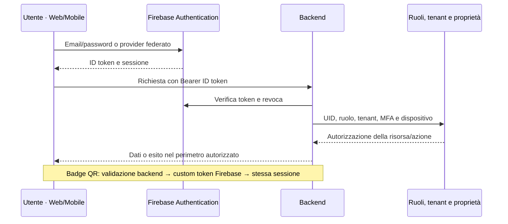
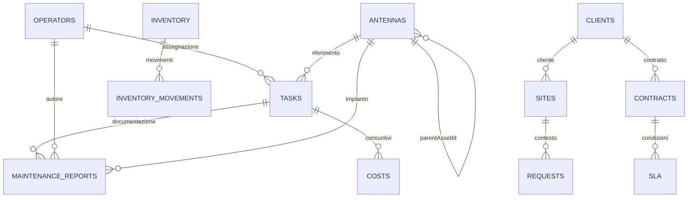

# RADIO TECH

**Ecosistema software per Control Room e operazioni tecniche sul campo**  
Presentazione tecnico-funzionale e commerciale · Settore Telecomunicazioni  
7 ottobre 2026 · Edizione di prodotto

RADIO TECH collega il coordinamento operativo della Control Room con l'esecuzione degli interventi sul campo. Asset, operatori, incarichi, report e materiali condividono identità, dati e servizi applicativi, con strumenti dedicati ai responsabili e ai tecnici.

**Web Control Room · Mobile Field Operations · Backend condiviso**

Progetto di Kevin Cagnazzo e Anthony Piccinonno.

## 1. Executive Overview

RADIO TECH centralizza la gestione operativa di asset, operatori, incarichi e interventi, creando un flusso informativo condiviso tra Control Room e personale tecnico sul campo. La piattaforma Web consente di censire gli apparati, assegnare attività, seguire stati e scadenze, esaminare report e coordinare risorse e materiali. L'applicazione Mobile porta sul dispositivo del tecnico gli incarichi assegnati, le informazioni dell'impianto, le checklist, la raccolta delle evidenze e la chiusura documentata del lavoro.

Il processo operativo ha una sequenza concreta: il responsabile assegna un incarico a un operatore e a un asset; il tecnico riceve una notifica, prende in carico l'attività e registra gli avanzamenti; al termine produce un report con misure, fotografie, materiali e firma acquisita sul dispositivo. La Control Room consulta gli allegati e il PDF, quindi approva o respinge il report. L'approvazione aggiorna lo stato dell'incarico; il servizio di inventario contabilizza i materiali collegati ai relativi articoli tramite ID o SKU.

Il medesimo ecosistema comprende inventario e lotti, incidenti, competenze, turni operativi, note e promemoria, strumenti RF/Telecom e una suite aziendale con clienti, siti, contratti, dispatch, manutenzioni periodiche, acquisti, consuntivi, documenti e richieste. Questi moduli estendono il coordinamento tecnico ai processi amministrativi direttamente collegati al lavoro sul campo.

Per un'organizzazione TLC il valore consiste nel rendere consultabile la relazione tra **apparato, attività, tecnico, risultato e materiale utilizzato**, con responsabilità esplicite e dati condivisi tra i due client. Le viste aggregate supportano la supervisione; le registrazioni di dettaglio sostengono la gestione e la ricostruzione delle attività effettuate.

## 2. RADIO TECH Ecosystem

| Componente | Destinatari e funzione |
|---|---|
| **radiotechwebapp — Web Platform** | Control Room, direzione, coordinamento di rete e amministrazione. Interfaccia browser per supervisione, gestione operativa e processi aziendali. |
| **Gestionale-radio — Mobile Application** | Tecnici e operatori sul campo. App Flutter con accesso agli incarichi personali, identificazione asset via QR, report, mappe, notifiche e strumenti tecnici. |
| **Backend applicativo** | Servizio Java/Spring Boot contenuto nel progetto Web. Espone API REST, applica autorizzazioni, transizioni operative, validazioni e automatismi. |
| **Data e identity layer** | Cloud Firestore per dati operativi; Firebase Authentication per identità e token; Firebase Cloud Messaging per notifiche; Firebase Storage per allegati nel profilo cloud. |
| **Servizi complementari** | Meteo e ricerca località Open-Meteo, cartografia OpenStreetMap, assistente con servizio Ollama e webhook aziendali configurabili. |
| **Portale clienti** | Accesso Web dedicato al ruolo CUSTOMER, con siti, richieste e documenti pubblicati nel perimetro del cliente. |

La collaborazione segue due percorsi complementari: le operazioni di processo passano dalle API condivise; alcune letture e aggiornamenti di vista utilizzano direttamente gli SDK Firebase con regole di accesso e filtro aziendale.

## 3. Business & Operational Value

| Esigenza operativa | Risposta RADIO TECH | Beneficio |
|---|---|---|
| Conoscere apparati, ubicazione e stato | Anagrafica asset, coordinate, parametri RF e mappa condivisa | Riferimento comune per coordinare il lavoro sui siti. |
| Assegnare responsabilità | Incarichi associati a operatore, asset, priorità e scadenza | Attività identificabili e assegnazioni consultabili da entrambi i client. |
| Seguire l'esecuzione sul campo | Presa in carico, viaggio, check-in GPS, avanzamenti e report | Visibilità delle fasi operative oltre alla semplice notifica iniziale. |
| Documentare il risultato | Checklist, misure, foto, firma e PDF riepilogativo | Evidenze raccolte nel contesto dell'intervento e disponibili alla Control Room. |
| Gestire approvvigionamenti e ricambi | Giacenze, soglie, ubicazioni, lotti, movimenti, acquisti e stock di bordo | Collegamento tra disponibilità dei materiali e attività tecnica. |
| Coordinare la squadra | Carico di lavoro, competenze, dispatch e turni | Informazioni utilizzabili per attribuire le attività alla risorsa appropriata. |
| Tenere sotto controllo scadenze e anomalie | Agenda, classificazione SLA, incidenti e alert | Priorità operative visibili e consultabili in modo uniforme. |
| Organizzare il rapporto con il cliente | Clienti, siti, contratti, richieste e portale dedicato | Informazioni e documenti collegati al contesto contrattuale e al sito. |
| Ricostruire decisioni e modifiche | Audit, timeline, versioni e registri di movimento | Tracciabilità delle azioni significative. |
| Preparare il tecnico in mobilità | Pacchetti di incarico, bozze e coda di sincronizzazione | Continuità del lavoro per le attività e i report predisposti sul dispositivo. |

## 4. Target Users

I ruoli applicativi sono trasmessi attraverso i custom claim dell'identità Firebase. Le autorizzazioni operative sono applicate nel backend e, per la suite aziendale, anche a livello di modulo e azione.

| Profilo | Obiettivo | Funzionalità e interfaccia | Valore operativo |
|---|---|---|---|
| **SUPER_ADMIN / ADMIN** | Amministrare il sistema e il perimetro aziendale | Control Room, account, asset, operatori, suite aziendale, dispositivi; accesso Mobile operativo | Gestione di identità, risorse e processi da uno stesso ecosistema. |
| **CHIEF_EXECUTIVE**, alias **CAPO** | Governare attività e consuntivi | Web Control Room, account e profilo direzionale; suite aziendale Mobile | Lettura trasversale di operatività, approvazioni e dati aziendali. |
| **NETWORK_MANAGER** | Coordinare attività di rete e personale | Web: assegnazioni, agenda, carichi, incidenti, magazzino e moduli consentiti; Mobile: suite aziendale | Coordinamento per scadenze, competenze, sito e responsabilità. |
| **OPERATOR**, alias **OPERATORE** | Eseguire e documentare il lavoro | Mobile: incarichi propri, GPS, asset, report, strumenti, notifiche, turni; moduli aziendali abilitati al personale field | Accesso contestuale a informazioni, azioni ed evidenze dell'attività. |
| **VIEWER** | Consultare dati di supervisione | Control Room e viste della suite aziendale in lettura | Visibilità operativa con profilo di consultazione. |
| **CUSTOMER** | Seguire il proprio perimetro di servizio | Portale Web e suite Mobile: siti, richieste e documenti destinati al cliente | Consultazione e gestione delle richieste collegate al proprio clientId. |

Per il Mobile, operatori e amministratori accedono alla home operativa; direzione, coordinamento, profili di consultazione e clienti accedono alla suite aziendale con il catalogo appropriato al ruolo.

## 5. Technology Stack

Le versioni indicate provengono dai manifest di progetto e dalle configurazioni di build. Le tecnologie elencate hanno un impiego individuabile nei sorgenti applicativi.

| Layer | Tecnologia | Utilizzo nel sistema |
|---|---|---|
| Linguaggio backend | Java 21 | Controller, servizi, modelli, sicurezza e processi applicativi. |
| Framework backend | Spring Boot 4.1.0 | Runtime HTTP, configurazione, dependency injection e scheduler. |
| Web e template | Spring Web, Thymeleaf, HTML, CSS, JavaScript | Control Room e portale clienti serviti dal backend; moduli frontend dedicati. |
| Autorizzazione | Spring Security, Firebase Admin SDK 9.11.0 | Bearer token, verifica dell'identità, ruoli, tenant e permessi. |
| Validazione e API | Jakarta Validation, springdoc OpenAPI 3.1.1 | Validazione DTO e descrizione del contratto REST. |
| Persistence | Google Cloud Firestore | Documenti aziendali, query per tenant, transazioni e listener. |
| Identity frontend | Firebase JavaScript SDK 12.19.0 | Login federato, autenticazione e listener inventario Web. |
| Mobile | Flutter e Dart; vincolo SDK Dart ^3.12.2 | Interfacce field, navigazione e integrazioni native. |
| Stato Mobile | StatefulWidget, FutureBuilder, StreamBuilder, Flutter Riverpod 3.4.2 | Stato delle schermate, caricamenti, stream e provider dell'asset. |
| Firebase Mobile | Firebase Core, Auth, Firestore, Storage, Messaging | Identità, dati condivisi, allegati e notifiche. |
| Networking | Fetch Web; package http Mobile | Chiamate REST autenticate, configurazione endpoint e gestione degli esiti. |
| Storage locale Mobile | Flutter Secure Storage, SharedPreferences, path_provider | Identificativo dispositivo, badge e pacchetti; impostazioni, bozze, coda e staging allegati. |
| Mappe | Leaflet 1.9.4; flutter_map e latlong2; OpenStreetMap | Visualizzazione georeferenziata degli asset su Web e Mobile. |
| Posizione e acquisizione | geolocator, mobile_scanner, image_picker, signature | Check-in/check-out, scansione QR, fotografie e firma dell'operatore. |
| QR | ZXing 3.5.3, qr_flutter, gal | Generazione backend, presentazione del badge e salvataggio immagine sul dispositivo. |
| Documenti | pdf e printing Mobile; PDF.js 6.4.299 Web | Generazione report, anteprima, stampa e visualizzazione PDF integrata. |
| Calcolo tecnico | Java, JavaScript, Dart e math_expressions | API RF, calcolatori TelcoTools e calcolatrice scientifica. |
| Notifiche | Firebase Cloud Messaging; flutter_local_notifications | Push remoto, notifiche locali e apertura dell'incarico collegato. |
| Meteo | Open-Meteo | Geocoding, condizioni correnti e previsioni giornaliere. |
| Assistente | Ollama | Chat tecnica con contesto applicativo selezionabile. |
| Indicatori grafici | CSS, SVG e widget Flutter | Indicatori di stato, disponibilità, priorità e avanzamento delle checklist. |
| Osservabilità | Actuator, Micrometer, Prometheus, OpenTelemetry/OTLP | Health, readiness/liveness, metriche e tracing configurabile. |
| Build e verifica | Gradle, npm, esbuild 0.28.2, Playwright 1.63.0, Flutter test | Build backend, bundle autenticazione Web e verifiche automatizzate. |
| Packaging e deploy | Docker, Docker Compose, Caddy, manifest Kubernetes, GitHub Actions | Pacchettizzazione Java, profili di esecuzione, reverse proxy TLS e pipeline. |

## 6. System Architecture

Il backend organizza il prodotto in controller REST, servizi di dominio, DTO validati, modelli e componenti di sicurezza. La Control Room è una web application server-rendered con interazione JavaScript; il Mobile è un client Flutter autonomo che utilizza il medesimo backend e il medesimo sistema d'identità.

Il dato operativo è persistito in Cloud Firestore. Il tenant della richiesta deriva dall'identità verificata; le entità aziendali vengono lette e modificate nel relativo perimetro. Le operazioni che coinvolgono più documenti — per esempio consumi di magazzino e azioni della suite — utilizzano transazioni e chiavi applicative di idempotenza. Gli aggiornamenti di stato producono audit e timestamp utili a ricostruire il processo.

Le API gestiscono le scritture di processo, i controlli di proprietà degli incarichi, le transizioni, l'approvazione dei report e la gestione dei materiali. Sul Mobile, Firestore è utilizzato anche per stream degli asset e letture della home; sul Web un listener inventario segnala le variazioni che attivano l'aggiornamento della vista tramite API.

Il packaging comprende un'immagine Docker Java 21, avvio tramite Compose, reverse proxy Caddy e manifest Kubernetes. Le configurazioni distinguono ambiente locale/test e produzione, includendo gestione del ciclo di vita del servizio, health check e impostazioni di osservabilità.

## 7. radiotechwebapp — Analisi Funzionale Completa

La Control Room presenta un'interfaccia comune con navigazione per moduli, ricerca e filtri contestuali, dialoghi operativi, notifiche di esito e aggiornamento dei dati. Il logo riporta alla dashboard; il footer riunisce navigazione, stato di collegamento, ultimo aggiornamento e riferimenti del prodotto.

### 7.1 Accesso e sessione

**Obiettivo e utenti.** Accesso alla Control Room per i profili aziendali autorizzati. **Funzioni.** Login email/password, accesso Google e Microsoft attraverso Firebase, gestione della richiesta di secondo fattore TOTP, scelta della persistenza della sessione, recupero e rinnovo token, logout. La configurazione pubblica del backend guida l'inizializzazione dei provider. **Dati/API.** Identità, role e tenantId; /auth/login, /auth/verify, /auth/refresh, /auth/me e /auth/public-config. **Workflow e beneficio.** L'accesso inizializza il profilo e le viste autorizzate, mantenendo coerente il perimetro dei dati durante la sessione.

### 7.2 Dashboard e console ambiente

**Obiettivo e utenti.** Quadro sintetico per Control Room, direzione e coordinamento. **Funzioni.** Contatori asset, operatori, interventi e incarichi; scorte basse e scadenze; stato della rete e disponibilità; mappa Leaflet con marker e accesso al dettaglio; azioni rapide per inserimento asset e invio comunicazioni. Console con data italiana, ora hh:mm:ss, piccolo orologio analogico, scelta località da antenna o ricerca paese/città, posizione del browser, aggiornamento meteo, temperatura, condizione, dati ambientali e previsioni a cinque giorni espandibili. Widget di riepilogo per asset attivi, incarichi scaduti, report da esaminare e scorte. **Dati/API.** /dashboard/stats, /antennas, /tasks, /reports, /inventory, /weather e /weather/locations. **Workflow e beneficio.** Il responsabile legge lo stato sintetico e passa al modulo di gestione o all'asset rappresentato sulla mappa.

### 7.3 Calendario operativo

**Obiettivo e utenti.** Appunti e promemoria personali del personale autenticato. **Funzioni.** Barra orizzontale di sette giorni, precedente/successiva, ritorno a oggi, selezione diretta della data, nota testuale, data/ora del reminder, salvataggio e indicazione della programmazione o dell'invio. **Dati/API.** calendarNotes, ownerUid, day, note e reminderAt; GET /calendar e PUT /calendar/{day}. **Workflow e beneficio.** La nota salvata sul Web è consultabile dal medesimo utente sul Mobile; il backend genera la notifica quando il promemoria arriva a scadenza.

### 7.4 Antenne e asset

**Obiettivo e utenti.** Censimento e consultazione degli apparati. **Funzioni.** Tabella con ricerca e filtro stato; nome, ubicazione, stato e dati tecnici; creazione, modifica e cancellazione tramite dialoghi; coordinate e anagrafica tecnica; dettaglio asset; generazione QR, stampa e download del codice per identificazione sul campo. **Dati/API.** antennas e relazione parentAssetId; /dashboard/antenne e /antennas/{id}, /history, /qr. **Workflow e beneficio.** Un asset censito dalla Control Room diventa riferimento per mappa, incarichi, report e scansione Mobile.

### 7.5 Gestione operatori

**Obiettivo e utenti.** Amministrazione del personale e delle credenziali. **Funzioni.** Ricerca, filtro ruolo, anagrafica e stato, livello e turno, ultima presenza; creazione delle credenziali con informazioni personali e aziendali; approvazione delle registrazioni; variazione ruolo; collegamento/sincronizzazione con UID Firebase; badge QR con stampa, validità standard, scadenza fissa o senza scadenza temporale, rigenerazione manuale e reset password; eliminazione definitiva dell'operatore e dell'identità associata secondo i controlli di ruolo e incarichi attivi. **Dati/API.** operators, identità Firebase; famiglia /operators e /auth/firebase-user. **Workflow e beneficio.** Il responsabile crea o approva l'operatore e rende disponibile l'accesso sul Mobile, conservando i report già registrati come documentazione operativa.

### 7.6 Operazioni e assegnazione incarichi

**Obiettivo e utenti.** Coordinamento delle attività tecniche. **Funzioni.** Form titolo, descrizione, operatore, antenna, priorità e scadenza; pulsante Assegna incarico; elenco attività con ricerca per titolo, descrizione, operatore, asset e stato; priorità e scadenza, aggiornamento della lista. Le API di dominio governano il lifecycle condiviso. **Dati/API.** tasks, operators e antennas; POST /tasks, GET /tasks e PATCH /tasks/{id}/status. **Workflow e beneficio.** L'assegnazione registra l'attività e invia una notifica TASK_ASSIGNED all'operatore, che consulta l'incarico nell'app.

### 7.7 Pianificazione e agenda

**Obiettivo e utenti.** Organizzare le attività in base a scadenza e risorsa. **Funzioni.** Ricerca per titolo, descrizione, operatore e asset; filtri attività attive, oggi, settimana, scadute, senza data e tutte; selezione operatore o non assegnati; raggruppamento per giorno e ordinamento per scadenza; contatori attivi, scaduti, senza scadenza e report in revisione; esportazione CSV; accesso al form di assegnazione. **Dati/API.** /tasks e /operators. **Workflow e beneficio.** Il coordinatore isola una finestra temporale e verifica quali attività necessitano assegnazione o follow-up.

### 7.8 Carico di lavoro

**Obiettivo e utenti.** Distribuzione della squadra per il responsabile operativo. **Funzioni.** Box per operatore con stato, incarichi attivi, scaduti e urgenti HIGH/CRITICAL; accesso alla lista filtrata dei suoi incarichi; rappresentazione dei gruppi non assegnati; aggiornamento. **Dati/API.** tasks e operators, condivisi con pianificazione. **Workflow e beneficio.** La vista aggregata permette di passare dalla risorsa al dettaglio del lavoro attribuito.

### 7.9 Centro report

**Obiettivo e utenti.** Esame degli esiti tecnici e approvazione da Control Room. **Funzioni.** Elenco con titolo «Report-Titolo compito assegnato-Nome Operatore-Data»; filtri per parola chiave, intervallo date, operatore e stato; compressione del singolo report e gestione dell'espansione; dettagli di note, checklist, misure e materiali; immagini visibili; anteprima immagini e visualizzatore PDF integrato con navigazione e zoom; download separato; approvazione o rifiuto con nota di revisione; aggiornamento elenco. **Dati/API.** maintenanceReports, taskTitle, antennaName, operatorName e attachments; /reports, /reports/{id}/approve e /reject; file privati o Firebase Storage. **Workflow e beneficio.** Il responsabile esamina le evidenze senza uscire dal contesto operativo e registra l'esito della revisione.

### 7.10 Notifiche

**Obiettivo e utenti.** Comunicazioni dalla Control Room al personale. **Funzioni.** Nuovo messaggio, titolo e testo, scelta destinatario o invio a tutti, elenco destinatari, cronologia con data e numero di consegne registrate, aggiornamento. **Dati/API.** notificationHistory, token FCM degli operatori; /notifications, /notifications/operator/{operatorId}, /notifications/broadcast e /notifications/recipients. **Workflow e beneficio.** La comunicazione è inviata come push e conservata per la consultazione Mobile. La creazione dell'incarico è un'operazione dedicata nel modulo Operazioni.

### 7.11 Magazzino e logistica

**Obiettivo e utenti.** Gestione ricambi per responsabili e amministratori. **Funzioni.** Anagrafiche, quantità, soglie e riordino; ricerca per nome/SKU/barcode/ubicazione, categoria e disponibilità; articoli attivi, sotto soglia e archiviati; creazione/modifica, archiviazione e ripristino; carico, scarico e rettifica; note, lotto e scadenza; storico movimenti; deposito/corsia/scaffale/vano; tabella lotti e disponibilità non assegnata a lotto; segnalazione lotti scaduti e articoli da reintegrare; indicatori logistici e valore stock; CSV articoli e stock/lotti; refresh e listener di variazione inventario. **Dati/API.** inventory e inventoryMovements; /inventory, /inventory/{id}/movements, /inventory/movements e /restore. **Workflow e beneficio.** Il materiale entra a stock, viene localizzato e tracciato, quindi è consumato da un movimento o dall'approvazione del report.

### 7.12 Riordino e approvvigionamento

**Obiettivo e utenti.** Preparazione del reintegro scorte. **Funzioni.** Proposte per articoli attivi con quantità minore o uguale alla soglia; ricerca nome, SKU, fornitore e posizione; raggruppamento ordinato per fornitore; quantità proposta e costo quando unitCost è presente; contatori di articoli, costo noto e quantità da definire; esportazione CSV e accesso al magazzino. **Dati/API.** /inventory; quantità proposta = max(reorderQuantity, minimumThreshold − quantity). **Workflow e beneficio.** La proposta rende disponibile una base strutturata per gli acquisti della suite aziendale.

### 7.13 Rischi, incidenti e competenze

**Obiettivo e utenti.** Supervisione delle anomalie e qualificazione della squadra. **Funzioni.** KPI incidenti aperti/critici, alert non letti e scadenze; ricerca e filtro per stato, asset e severità; creazione incidente, avanzamento di stato, causa e risoluzione; elenco alert e marcatura lettura; valutazione manuale dei rischi/SLA; selezione operatore e gestione competenze con livello, certificazione, scadenza e autorizzazione. **Dati/API.** incidents, alerts e operators/{id}/skills; /incidents, /alerts, /alerts/evaluate e /operators/{id}/skills. **Workflow e beneficio.** L'anomalia viene seguita fino alla risoluzione; le competenze censite alimentano il dispatch.

### 7.14 AI e previsioni operative

**Obiettivo e utenti.** Supporto all'analisi di priorità e alla preparazione di contenuti tecnici. **Funzioni.** Indicatori di asset, rischio e incarichi; ricerca delle schede asset; punteggio, ragioni, suggerimenti e stima della prossima manutenzione; esportazione CSV e aggiornamento; chat con messaggio, selezione del contesto, cronologia della conversazione, nuova chat e stato del provider. **Dati/API.** /ai/insights, /ai/status e /ai/chat; servizio di regole esplicabili per le priorità e servizio Ollama per le risposte testuali. **Workflow e beneficio.** Il responsabile analizza le motivazioni di rischio e consulta l'assistente con informazioni operative selezionate.

### 7.15 Squadra e sicurezza operativa

**Obiettivo e utenti.** Coordinamento del turno e segnalazioni dal personale. **Funzioni.** Inizio turno, pausa, ripresa e fine turno; dichiarazione di disponibilità READY, NEEDS_BREAK o REQUEST_SUPPORT; riepilogo squadra per i responsabili; minuti di attività e pausa, aggiornamento e indicazione di pausa suggerita; apertura segnalazione HAZARD, NEAR_MISS o SUPPORT_REQUEST con severità e asset opzionale; presa in carico e risoluzione. **Dati/API.** workforceShifts e workforceSignals; /workforce/me/shift, /workforce/shifts e /workforce/signals. **Workflow e beneficio.** La disponibilità dichiarata è consultabile insieme alle esigenze di supporto e contribuisce ai controlli di assegnazione.

### 7.16 TelcoTools

**Obiettivo e utenti.** Strumenti RF, IP, fibra ed energia per il personale tecnico e il coordinamento. **Funzioni.** Schede Panoramica, IP/CIDR, VLAN, 5G/LTE, Radio, Fibra, Manutenzione, Energia, Checklist e Report. IPv4/IPv6 e VLSM; VLAN e range; EARFCN/NR-ARFCN, lunghezza d'onda e lettura RSRP/RSRQ; EIRP, FSPL, Fresnel, link budget, azimuth/elevazione e ROS/return loss; budget ottico e margini PON; PIM, soglie RF/temperatura, autonomia e verifiche elettriche; consumo energetico; checklist con avanzamento e reset; riepilogo della sessione copiabile e salvabile in testo. **Dati/API.** Input del tecnico e calcoli locali JavaScript; il backend espone inoltre /telecom-tools per nove calcoli RF. **Workflow e beneficio.** Il tecnico imposta valori e ottiene risultati con unità e riferimenti nello stesso ambiente operativo.

### 7.17 Profilo e stato del sistema

**Obiettivo e utenti.** Gestione del profilo direzionale e verifica di collegamento. **Funzioni.** Consultazione e modifica informazioni del profilo Capo; dati di contatto, azienda e immagine; health backend/Firestore, informazioni di sessione, endpoint e identità, logout dal PC; elenco audit recente con compressione/espansione in una riga; riferimenti delle API. **Dati/API.** /capo/profile, /capo/last-seen, /health, /health/firebase e /dashboard/audit. **Workflow e beneficio.** Il responsabile mantiene le informazioni del proprio profilo e consulta lo stato dei servizi e delle azioni registrate.

### 7.18 Sicurezza e accessi

**Obiettivo e utenti.** Amministrazione delle identità aziendali. **Funzioni.** Associazione di un account Firebase tramite UID; ruolo, clientId, richiesta MFA e permessi proPermissions; revoca sessioni dell'account; enrollment TOTP per l'identità corrente; stato dei provider di accesso. **Dati/API.** /pro/security, PUT /pro/security/accounts/{uid} e POST /revoke; Firebase Authentication e custom claim. **Workflow e beneficio.** L'amministratore associa l'identità al contesto aziendale e applica il profilo di accesso previsto per il suo utilizzo.

### 7.19 Enterprise PRO — catalogo aziendale

**Obiettivo e utenti.** Processi aziendali collegati all'operatività TLC. Il backend restituisce un catalogo filtrato per ruolo e permessi; il frontend genera campi, riferimenti, elenchi e azioni. **Funzioni comuni.** Selezione modulo, ricerca testuale, aggiornamento, creazione e modifica dove previste, azioni contestuali, versioni e riscontri di esito; esportazione CSV Web. **API comuni.** /pro/catalog, /pro/options/{target}, /pro/{module} e /pro/{module}/{id}/actions.

| Modulo reale | Dati e operazioni disponibili | Risultato operativo |
|---|---|---|
| **Dispositivi e sessioni — devices** | UID, piattaforma, ultimo accesso e stato; revoca del dispositivo | Governo degli accessi associati alle installazioni. |
| **Indicatori e consuntivi — analytics** | Scadenze, attività approvate/chiuse, costi, budget, ore e tempi medi | Lettura trasversale dei consuntivi aziendali. |
| **Audit e modifiche — audit** | Attore, azione, risorsa, timestamp, valori prima/dopo | Consultazione delle modifiche registrate. |
| **Ordini e consegne — orders** | Ordini derivati dall'approvazione degli acquisti: fornitore, articolo, quantità, prezzo e approvatore | Collegamento tra decisione d'acquisto e ordine. |
| **Centrale di dispatch — dispatch** | Task, operatore, inizio/fine, competenze richieste e override disponibilità; ASSIGN e ARCHIVE | Assegnazione con controlli su competenze, turno e sovrapposizione temporale. |
| **Clienti — clients** | Nome, email, telefono, referente e note; creazione, modifica, ARCHIVE | Anagrafica del contesto commerciale. |
| **Siti — sites** | Nome, clientId, indirizzo e istruzioni d'accesso; ARCHIVE | Informazioni operative del luogo d'intervento. |
| **Contratti — contracts** | Cliente, sito, minuti di risposta/risoluzione, budget e termine; ARCHIVE | Riferimenti per SLA e consuntivi. |
| **Piani di manutenzione — plans** | Sito, antenna, operatore, intervallo giorni, prossima scadenza e checklist; GENERATE e ARCHIVE | Generazione di incarichi periodici con checklist. |
| **Fornitori — suppliers** | Nome, email, telefono e leadTimeDays; ARCHIVE | Riferimento per acquisti e tempi di fornitura. |
| **Richieste di acquisto — purchases** | Fornitore, articolo, quantità, prezzo, data prevista; SUBMIT, APPROVE, REJECT, RECEIVE | Iter di approvazione e ricezione a magazzino. |
| **Costi e ore — costs** | Task, contratto, tipo LABOUR/TRAVEL/MATERIAL/EXTERNAL, importo, ore, note; SUBMIT, APPROVE, REJECT | Consuntivazione del lavoro e delle spese. |
| **Documenti — documents** | Sito, antenna, contenuto, pubblico INTERNAL/CUSTOMER e revisioni; PUBLISH, ARCHIVE | Pubblicazione controllata delle informazioni. |
| **Passaggi di consegne — handovers** | Task, destinatario UID e note; ACKNOWLEDGE, ARCHIVE | Trasferimento documentato delle informazioni tra persone. |
| **Stock di bordo — vanstock** | Articolo e operatore, quantità e riservato; LOAD, RESERVE, CONSUME, RETURN | Materiali collegati al tecnico e all'utilizzo sul campo. |
| **Richieste di servizio — requests** | Cliente, sito, antenna, operatore, contratto, priorità e descrizione; ACKNOWLEDGE, ASSIGN, RESOLVE per i profili gestionali | Richiesta collegata al processo operativo e all'incarico. |
| **SLA operativi — sla** | Task e contratto; ACKNOWLEDGE, PAUSE, RESUME, RESOLVE; scadenze ed escalation | Seguito dei tempi di risposta e risoluzione. |
| **Integrazioni — integrations** | Nome, endpoint HTTPS ed eventi; ENABLE, DISABLE, ARCHIVE | Invio configurabile di eventi applicativi mediante webhook. |
| **Consegne webhook — deliveries** | Tentativi, risposta, ultimo tentativo e stato della consegna | Visibilità dell'esecuzione delle notifiche applicative esterne. |

Le richieste d'acquisto e i costi adottano approvazioni con distinzione tra chi presenta e chi approva. Dispatch, ricezione, stock di bordo e azioni della suite sono gestiti con transazioni e identificativi di operazione. Il personale field dispone dei moduli devices, costs, documents, handovers e vanstock ammessi dal proprio catalogo; il cliente accede a siti, richieste e documenti nel proprio perimetro.

### 7.20 Portale clienti

**Obiettivo e utenti.** Accesso del cliente alle informazioni che lo riguardano. **Funzioni.** Login dedicato CUSTOMER, rinnovo sessione, suite con siti associati, apertura e modifica delle proprie richieste e consultazione dei documenti pubblicati per il pubblico CUSTOMER; ricerca, dettagli e logout. **Dati/API.** clientId dell'identità, relazioni dei siti e dei documenti, API /pro. **Workflow e beneficio.** Il cliente inserisce una richiesta nel medesimo data layer utilizzato dalla Control Room e consulta la documentazione pubblicata per il suo contesto.

## 8. Web Dashboard

La dashboard aggrega documenti dello stesso tenant e rende esplicite consistenza del patrimonio, disponibilità dichiarata e situazione degli incarichi. I contatori derivano dal servizio DashboardService; i widget contestuali utilizzano anche gli elenchi operativi caricati dal frontend.

| Elemento | Origine e calcolo | Utilità per la Control Room |
|---|---|---|
| Asset/antenne censiti | Numero documenti antennas del tenant | Dimensione del patrimonio registrato. |
| Operatori e operatori attivi | Numero documenti operators; attivi con status ATTIVO | Dimensione della squadra e stato dell'anagrafica. |
| Interventi registrati | Conteggio della collection interventions | Riepilogo del registro interventi. |
| Incarichi | Numero documenti tasks | Volume delle attività censite. |
| Articoli inventario e scorte basse | Documenti inventory; lowStock quando quantity ≤ minimumThreshold | Evidenza degli articoli da reintegrare. |
| Stato asset | Conteggi ATTIVA, MANUTENZIONE e OFFLINE | Lettura del patrimonio secondo lo stato registrato. |
| Disponibilità asset | activeAntennas / antennas × 100, arrotondato a due decimali | Quota di asset dichiarati attivi sul totale censito. |
| Distribuzione task | Conteggi ASSIGNED, IN_PROGRESS, COMPLETED e CANCELLED | Lettura delle fasi operative selezionate. |
| Scadenze superate / a rischio | Confronto dueAt con l'istante corrente e finestra di preavviso configurata, standard 60 minuti | Priorità temporali per le attività considerate dal riepilogo. |
| Report da esaminare | Elenco report filtrato per stato di revisione | Accesso alle attività di approvazione. |
| Mappa asset | Coordinate lat/lng e status della stessa anagrafica | Collegamento geografico tra situazione e impianto. |
| Meteo e condizioni ambientali | Località selezionata e servizio Open-Meteo | Contesto ambientale per coordinamento e preparazione dell'uscita. |

La disponibilità rappresenta lo **stato anagrafico degli asset**. La classificazione temporale SLA utilizza gli stati UNSCHEDULED, ON_TRACK, AT_RISK, BREACHED e INVALID del componente di policy; le viste di agenda evidenziano in particolare le attività operative attive.

La suite Enterprise PRO aggiunge sei consuntivi: incarichi oltre scadenza; attività APPROVED/CLOSED; somma degli importi approvati; somma dei budget dei contratti attivi; ore approvate; tempo medio tra creazione e completamento per le attività approvate o chiuse con entrambi i timestamp. Sono indicatori ricostruiti dai record di lavoro e dai consuntivi, collegati alle rispettive entità.

## 9. Asset / Antenna Management

L'asset è il punto di collegamento tra ubicazione, proprietà tecniche, incarichi e documentazione di intervento. La piattaforma utilizza la collection **antennas** anche per apparati e componenti diversi dall'antenna fisica.

| Gruppo | Campi reali |
|---|---|
| Identità e organizzazione | id, tenantId, name, code, assetType, parentAssetId |
| Dati del costruttore | serialNumber, manufacturer, model, installationDate |
| Localizzazione | site, lat, lng |
| Stato | status: ATTIVA, MANUTENZIONE, OFFLINE, CRITICA nelle interfacce operative |
| Parametri tecnici | specs: Frequenza, Potenza, ROS, Temperatura; DTO con frequencyMHz, powerWatts, ros e temperature |
| Tracciamento | createdAt, updatedAt |

I tipi supportati dal servizio sono **SITE, TOWER, SECTOR, ANTENNA, RRU, BBU, ROUTER, SWITCH, UPS, BATTERY, GENERATOR, FIBER e MICROWAVE**. La relazione parentAssetId collega un componente a un asset padre nello stesso tenant, consentendo una rappresentazione gerarchica del patrimonio tecnico.

Sul Web, il responsabile crea, modifica, ricerca e filtra gli asset, consulta il dettaglio e genera il QR dell'impianto. Sul Mobile, il tecnico può raggiungere lo stesso impianto dalla mappa o dalla scansione, consultare dati tecnici e storico, avviare i controlli e preparare un report. La creazione Mobile dell'asset è resa disponibile agli amministratori.

Il servizio di risoluzione dell'asset riconosce riferimenti documentali e codici, oltre ai dati estratti dal QR. Il QR dell'asset svolge la funzione di **identificazione dell'impianto**; il badge personale svolge la distinta funzione di accesso dell'operatore.

## 10. Operator / Workforce Management

L'anagrafica operatori raccoglie **fullName, email, phone, birthDate, company, specialization, level, shift, status, role, firebaseUid e lastSeen**, oltre agli identificativi aziendali e ai timestamp. I campi del badge includono qrValidityMode, qrExpiresAt, qrFixedExpiresAt, qrUsedAt e qrLastUsedAt. Il servizio conserva anche i token FCM utilizzati per le notifiche.

La registrazione tramite invito aziendale produce uno stato **IN_ATTESA**; l'approvazione abilita l'operatore e assegna i claim dell'identità. Lo stato **ATTIVO** è utilizzato dai riepiloghi operativi. Il responsabile può creare le credenziali direttamente dalla Control Room, sincronizzare il collegamento con Firebase e gestire ruolo, badge e reset password.

Le competenze sono documenti della subcollection **operators/{operatorId}/skills**. Il catalogo include **RF, LTE, 5G, FIBER, IP, MICROWAVE, POWER, HVAC e SAFETY**; ogni competenza ha livello da 1 a 5, certificazione, scadenza e autorizzazione. Il dispatch verifica le competenze richieste rispetto a quelle dell'operatore, incluse validità e autorizzazione.

La disponibilità del turno è registrata separatamente in workforceShifts: **OFF_DUTY, ACTIVE, BREAK**, con readiness **READY, NEEDS_BREAK, REQUEST_SUPPORT**. Sono memorizzati minuti di attività e pausa, transizioni e versione. Le segnalazioni workforceSignals collegano persona, tipo, severità, descrizione e asset opzionale a un iter **OPEN → ACKNOWLEDGED → RESOLVED**.

Il Mobile consente al tecnico di aggiornare il proprio turno, dichiarare necessità di pausa o supporto e inviare una segnalazione; il Web mostra la squadra e permette la gestione delle segnalazioni. Il carico di lavoro collega questi dati agli incarichi effettivamente assegnati.

## 11. Task Management

Il task contiene **title, description, operatorId, operatorName, operatorFirebaseUid, antennaId, status, priority, dueAt, createdAt, updatedAt, completedAt e metadata**. Le coordinate e i timestamp di check-in/check-out sono associati al medesimo record; createdBy e updatedBy identificano gli attori memorizzati.

Le priorità canoniche sono **LOW, MEDIUM, HIGH e CRITICAL**. Il form Web assegna l'attività al tecnico e al relativo asset; il servizio acquisisce nome e UID dell'operatore, valida la scadenza e crea normalmente il task nello stato **ASSIGNED**.

| Stato reale | Significato nel processo |
|---|---|
| CREATED | Attività creata nel modello di lifecycle. |
| ASSIGNED | Attività assegnata. |
| ACCEPTED | Presa in carico dal tecnico. |
| EN_ROUTE | Operatore in trasferimento verso il sito. |
| CHECKED_IN | Arrivo registrato con coordinate. |
| IN_PROGRESS | Esecuzione in corso. |
| WAITING | Attività in attesa, riprendibile. |
| COMPLETED | Esecuzione completata. |
| REPORT_SUBMITTED | Report inviato alla revisione. |
| APPROVED | Esito approvato. |
| CLOSED | Attività chiusa. |
| CANCELLED | Attività annullata. |

L'annullamento CANCELLED è previsto dagli stati intermedi fino ad APPROVED; CLOSED e CANCELLED sono terminali. Il diagramma rappresenta le fasi del flusso principale e l’attesa. Sono previste anche le transizioni COMPLETED → APPROVED e REPORT_SUBMITTED → CLOSED. Il servizio verifica le transizioni, il ruolo e l'associazione del tecnico all'incarico.

Il check-in e il completamento Mobile acquisiscono GPS e verificano la distanza dall'asset attraverso la policy di geofencing, con raggio configurabile e valore standard di 250 metri. L'API applica controlli di identità e registrazione temporale; le chiamate di avanzamento supportano chiavi di idempotenza per riconoscere operazioni ripetute.

L'incarico assegnato genera una notifica con taskId. L'app utilizza quel riferimento per aprire l'attività corretta, caricarla dalla lista personale e proporre l'azione successiva coerente con lo stato. Il report costituisce il passaggio dall'esecuzione alla revisione della Control Room.

## 12. Intervention Management

L'intervento operativo è digitalizzato attraverso l'associazione di **incarico, asset, operatore e maintenance report**. Il task descrive la responsabilità e le fasi di esecuzione; il report conserva il risultato tecnico e le evidenze.

Il report registra taskId/taskTitle, antennaId/antennaName, operatore e UID, avvio/completamento/invio, descrizione e lavoro svolto, findings, operatorNotes, misure, checklist, materiali, allegati e posizione. Nome dell'operatore e riferimenti dell'impianto sono ricostruiti dal backend nel contesto dell'identità e delle entità associate.

Gli stati del report sono **SUBMITTED, APPROVAL_PENDING, APPROVED e REJECTED**. SUBMITTED rappresenta l'invio; APPROVAL_PENDING è lo stato utilizzato durante il processo di approvazione; APPROVED e REJECTED registrano l'esito. reviewedAt, reviewedBy e reviewNote documentano la revisione.

Il documento PDF Mobile include logo RadioTech, nome dell'antenna, operatore, data e ora, descrizione, controlli, materiali, misure, fotografie e firma acquisita. Il PDF e le immagini vengono allegati al report e consultati dalla Control Room. Lo storico Mobile associa i task completati ai report disponibili e permette il download del solo PDF riepilogativo, oltre ad anteprima e stampa.

Il modello **Intervention**, nella collection interventions, contiene id, antennaId, operatorId, operatorName, type, description, status, createdAt, completedAt e reportUrl ed è letto dal riepilogo Web. Il flusso di esecuzione e approvazione descritto in questa sezione utilizza le entità tasks e maintenanceReports.

## 13. Inventory Management

Il magazzino è una gestione di articoli e movimenti collegata alle attività operative. Ogni articolo comprende **sku, name, category, description, unit, quantity, minimumThreshold, reorderQuantity, supplier, barcode, unitCost e active**. La posizione è articolata in **warehouse, aisle, rack, bin e location**. I lotti sono memorizzati in lots con codice, quantità e expiresOn.

| Processo | Operazioni implementate |
|---|---|
| Censimento e aggiornamento | Creazione articolo, modifica attributi, quantità iniziale e anagrafica. |
| Ciclo di vita | Archiviazione active=false e ripristino. |
| Movimento | RECEIPT, ISSUE e ADJUSTMENT con attore, nota, quantità e saldo. |
| Tracciabilità | Registro inventoryMovements, posizione strutturata, lotto e scadenza. |
| Consumo da intervento | Approvazione del report, risoluzione del materiale censito tramite ID o SKU, contabilizzazione idempotente e movimento CONSUMPTION. |
| Scorte | Confronto quantity ≤ minimumThreshold, quantità di riordino e proposte di reintegro. |
| Acquisto | Richiesta, presentazione, approvazione da altro soggetto e ricezione tramite suite PRO. |
| Stock di bordo | LOAD, RESERVE, CONSUME e RETURN per articolo e operatore. |
| Reporting | Tabelle, ricerca, filtri, valore delle giacenze, lotti, movimenti ed export CSV. |

Le movimentazioni verificano la disponibilità e mantengono i saldi in transazione. La gestione dei lotti tiene conto della scadenza nel prelievo; il consumo approvato è associato al report e riconosciuto tramite identificativo di operazione. Questo collega il consuntivo tecnico al materiale effettivamente registrato in inventario.

## 14. Gestionale-radio — Analisi Mobile Completa

La Mobile App utilizza un tema condiviso RadioTech, logo ufficiale, superfici scure, contenitori coerenti, transizioni e indicatori operativi. I componenti di safe area adattano il contenuto alle aree di sistema del dispositivo. La navigazione combina route Flutter, schermate dedicate e controllo della sessione.

### 14.1 Avvio, accesso e registrazione

**Scopo e utenti.** Inizializzare Firebase e autenticare l'identità. **Funzioni e azioni.** Login email/password, Google e Microsoft, scansione badge personale, reset password, accesso alla configurazione backend; creazione account con invito aziendale e schermata di attesa approvazione. **Dati e stati.** Identità Firebase, ruolo, tenant, sessione approvata o in attesa; campi dell'operatore. **API.** /auth/login, /auth/verify, /auth/qr-login, /auth/public-config, /operator/register e session/devices. **Navigazione e beneficio.** L'AccessGate instrada l'utente verso la home field o la suite aziendale appropriata.

### 14.2 Home operativa

**Scopo e utenti.** Punto di partenza del tecnico e degli amministratori che operano sul campo. **Funzioni.** Logo, data e ora correnti; profilo e badge personale; indicatori di attività, report e notifiche; riepilogo degli incarichi; blocco Azioni operative con accessi a incarichi, report, scansione, mappa, storico, agenda, AI, squadra, incidenti, Enterprise PRO, calcolatrice e TelcoTools. Il calendario si apre mediante un pulsante dedicato. **Dati/API.** Letture Firestore con filtro aziendale/personale, API degli incarichi e servizi condivisi. **Stati e navigazione.** Stato sessione, caricamento dati, revisione della coda offline e aperture contestuali. **Beneficio.** Il tecnico raggiunge l'azione appropriata a partire dal proprio lavoro e dalle comunicazioni ricevute.

### 14.3 Incarichi

**Scopo.** Eseguire le attività assegnate. **Dati visualizzati.** Titolo, asset, descrizione, priorità, stato e scadenza; indicazione attività scadute. **Azioni.** Ricerca e filtro, aggiornamento, presa in carico, in viaggio, check-in, avvio e accesso al report secondo nextAction del task. **API.** /operator/me/tasks e /operator/tasks/{id}/accept, /en-route, /check-in, /start, /wait, /complete e /report. **Stati.** Lifecycle del task e occupazione dell'azione durante l'invio. **Navigazione.** Apertura anche da notifica con evidenza dell'incarico selezionato; aggiornamento al ritorno dell'app in primo piano. **Beneficio.** Il tecnico dispone dell'attività reale e dell'azione successiva prevista dal processo.

### 14.4 Agenda

**Scopo.** Organizzare gli incarichi personali per scadenza. **Funzioni.** Ricerca, finestre temporali e raggruppamento delle attività, priorità, stato e apertura del dettaglio operativo. **Dati/API.** TaskSummary e /operator/me/tasks. **Stati e navigazione.** Attività attive, scadute o senza pianificazione; collegamento a Incarichi. **Beneficio.** Lettura ordinata del lavoro da eseguire sul campo.

### 14.5 Calendario e note

**Scopo.** Consultare il calendario e salvare note personali. **Funzioni.** Navigazione mese, selezione giorno, riferimenti agli incarichi, nota e reminder con data/ora, salvataggio. **Dati/API.** Incarichi personali e calendarNotes tramite /calendar e /calendar/{day}. **Navigazione.** Apertura dalla home e collegamento all'agenda. **Beneficio.** Note e promemoria della stessa identità restano condivisi tra Web e Mobile.

### 14.6 Scansione asset e scelta dell'azione

**Scopo.** Identificare l'impianto sul posto. **Funzioni.** Scansione camera e risoluzione del contenuto QR; scelta tra consultazione impianto e avvio del report. **Dati/API.** /antennas/resolve/{reference}. **Stati e navigazione.** Acquisizione, risoluzione e asset riconosciuto; accesso ad AntennaDashboard o alla compilazione. **Beneficio.** Connessione immediata tra apparato fisico e documentazione operativa.

### 14.7 Dashboard antenna

**Scopo.** Consultare il riferimento tecnico dell'impianto. **Funzioni.** Nome, stato, ubicazione, frequenza, potenza, ROS e temperatura; aggiornamenti del documento; accesso ai controlli, al report e allo storico dell'asset. **Dati.** Modello Antenna e provider Riverpod/stream Firestore nel tenant. **Navigazione.** Da scansione o mappa verso checklist e storico. **Beneficio.** Dati tecnici e attività raccolti intorno allo stesso identificativo asset.

### 14.8 Mappa antenna

**Scopo.** Individuare gli impianti sul territorio. **Funzioni.** Mappa flutter_map con base OpenStreetMap, marker delle antenne e selezione dell'impianto. **Dati.** Coordinate e stati da Firestore nel perimetro aziendale. **Navigazione.** Marker verso dashboard antenna. **Beneficio.** Ricerca e contestualizzazione geografica prima della consultazione tecnica.

### 14.9 Nuova antenna

**Scopo e utenti.** Inserire un asset dal dispositivo per ADMIN e SUPER_ADMIN. **Funzioni.** Form con nome, posizione, stato e parametri tecnici; validazione e salvataggio. **API.** POST /dashboard/antenne. **Navigazione.** Azione visibile nella home amministrativa. **Beneficio.** Censimento dell'impianto direttamente durante l'attività sul campo.

### 14.10 Nuovo report e checklist

**Scopo.** Preparare un intervento documentato sull'antenna selezionata. **Funzioni.** Selezione antenna; modelli «Manutenzione preventiva», «Intervento correttivo», «Installazione e collaudo»; controlli specifici dell'asset quando presenti; aggiunta di controlli personalizzati; spunte interattive e avanzamento. La schermata Checklist è anche utilizzata nel percorso avviato dalla dashboard dell'antenna. **Dati/API.** /antennas, checklist e riferimento antennaId. **Stati e navigazione.** Esito dei controlli per voce; passaggio a ReportClosureScreen. **Beneficio.** Il report nasce da una sequenza di verifiche contestualizzata al tipo di lavoro.

### 14.11 Compilazione e chiusura report

**Scopo.** Registrare lavoro ed evidenze e inviarli alla Control Room. **Dati e azioni.** Note/lavoro svolto, segnalazione alla centrale e findings, misure parametro-valore, materiali e quantità, fotografie da camera/galleria, firma disegnata con cancellazione, checklist ricevuta, identità operatore e nome impianto. Salvataggio e ripristino bozza, preparazione del PDF, acquisizione GPS e invio con avanzamento per fasi. **API.** /operator/reports o /operator/tasks/{id}/report; storage degli allegati, /files/config e /files nel profilo locale. **Stati.** Bozza, preparazione, upload, invio, report accettato o operazione in coda; esito con riferimento del report e dati di integrità. **Navigazione.** Da incarico, nuovo report, scansione o checklist; ritorno alle attività e allo storico. **Beneficio.** Evidenze e documento vengono raccolti e trasmessi nel contesto dell'attività, con riconoscimento degli invii già effettuati.

### 14.12 Storico interventi

**Scopo.** Consultare gli esiti del lavoro personale. **Funzioni.** Unione dei report personali e degli incarichi completati; ricerca per contenuto e riferimenti; stato, titolo dell'attività, nome impianto, data e operatore; anteprima PDF, stampa/condivisione e download del solo riepilogo PDF. Su Android il salvataggio usa il selettore documenti nativo. **API.** /operator/me/reports, /operator/me/tasks; riferimenti file del report. **Stati.** Completamento task ed esito della revisione. **Beneficio.** Il tecnico recupera la documentazione del lavoro effettuato dallo stesso dispositivo.

### 14.13 Storico asset

**Scopo.** Ricostruire le attività relative a un impianto. **Funzioni.** Elenco ordinato di incarichi e report con date e informazioni operative. **API.** /antennas/{id}/history. **Navigazione.** Accesso dalla dashboard antenna. **Beneficio.** Consultazione contestuale delle registrazioni precedenti sull'asset.

### 14.14 Notifiche

**Scopo.** Ricevere e consultare comunicazioni operative. **Funzioni.** Elenco personale, indicazione lettura, apertura e conferma di presa visione; apertura dell'incarico collegato; gestione push in primo piano, background e avvio da notifica mediante FCM e notifiche locali. **API.** /operator/me/notifications, /{id}/read e /{id}/acknowledge; registrazione del token FCM. **Stati.** Letta/non letta e acknowledged. **Beneficio.** Comunicazione e attività restano collegate tramite taskId quando il messaggio riguarda un incarico.

### 14.15 Profilo e badge personale

**Scopo.** Gestire il proprio riferimento anagrafico e d'accesso. **Funzioni.** Consultazione/modifica del profilo, dati personali e turno; QR generato dallo stesso servizio Web, scadenza e aggiornamento automatico; salvataggio PNG sul dispositivo; reset password con rotazione del badge; impostazioni backend e logout. **API.** GET/PUT /operator/me, /operator/me/badge e /operator/me/reset-password. **Stati.** Validità del badge e sessione; refresh periodico, stream del profilo e aggiornamento al ritorno in foreground. **Beneficio.** Il tecnico dispone del proprio badge e dei riferimenti d'accesso aggiornati.

### 14.16 Incidenti

**Scopo.** Consultare le anomalie operative. **Funzioni.** Elenco, dettagli e stato; per gli amministratori Mobile, apertura e transizioni con causa e risoluzione. **API.** /incidents e /incidents/{id}/transitions. **Stati.** DETECTED fino a CLOSED, severità LOW/MEDIUM/HIGH/CRITICAL. **Beneficio.** Lo stesso incidente è consultabile nel sistema condiviso e gestibile secondo le autorizzazioni dell'utente.

### 14.17 Squadra, turno e segnalazioni

**Scopo.** Dichiarare disponibilità e necessità operative. **Funzioni.** Avvio/pausa/ripresa/fine turno; readiness, contatori attività/pausa; apertura segnalazioni con severità e asset; consultazione e gestione di squadra/segnalazioni per i profili consentiti. **API.** /workforce/me/shift, /workforce/shifts e /workforce/signals. **Stati.** OFF_DUTY/ACTIVE/BREAK e OPEN/ACKNOWLEDGED/RESOLVED. **Beneficio.** Informazioni di disponibilità e supporto condivise con chi coordina il lavoro.

### 14.18 AI e previsioni

**Scopo.** Consultare priorità tecniche e assistente. **Funzioni.** Schede di rischio con punteggio, motivazioni e indicazioni operative; aggiornamento; chat e selezione del contesto. **API.** /ai/insights, /ai/status e /ai/chat. **Dati.** Asset e attività nel perimetro autorizzato dell'utente. **Navigazione.** Due aree dedicate ad analisi e conversazione. **Beneficio.** Supporto leggibile alla preparazione del lavoro e alla consultazione tecnica.

### 14.19 Enterprise PRO e sicurezza

**Scopo.** Utilizzare i processi aziendali disponibili al ruolo anche in mobilità. **Funzioni.** Catalogo, selezione modulo, ricerca, elenco e dettagli; editor dei campi e riferimenti; azioni contestuali e aggiornamento. La schermata Sicurezza presenta associazione account, ruolo, cliente, permessi, revoca ed enrollment MFA per gli utenti abilitati. **API.** /pro/catalog, /pro/options/{target}, /pro/{module}, /actions e /pro/security. **Stati.** Stato e versione del record secondo modulo. **Beneficio.** Costi, documenti, passaggi di consegne e materiali di bordo sono accessibili nel processo field; clienti e direzione accedono al proprio catalogo dedicato.

### 14.20 Pacchetti offline e sincronizzazione

**Scopo.** Preparare un incarico e conservarne informazioni ed elaborati sul dispositivo. **Funzioni.** Download del pacchetto per taskId; elenco e consultazione task/sito/documenti, checklist e preparazione report; memorizzazione sicura del pacchetto associata a UID e tenant, con validUntil; bozze e allegati in staging locale. Il pannello di sincronizzazione mostra operazioni pendenti, ritentativi e azioni di retry/scarto. **API.** /pro/task-packs/{id}; successiva sincronizzazione delle azioni task e dei report verso le relative API. **Stati.** Pacchetto valido, operazione pendente, retry e ricevuta di sincronizzazione. **Beneficio.** Il tecnico prepara i dati dell'attività e segue l'invio delle operazioni e dei report registrati sul dispositivo.

### 14.21 Configurazione backend

**Scopo.** Collegare il client al servizio applicativo previsto. **Funzioni.** Indirizzo del backend, verifica health, salvataggio impostazione, utilizzo dell'origine contenuta nel badge QR con conferma del riferimento server. **Dati/API.** Endpoint locale salvato e /health. **Navigazione.** Login e profilo. **Beneficio.** Web e Mobile possono essere indirizzati al medesimo servizio pubblicato in HTTPS.

### 14.22 Calcolatrice

**Scopo.** Calcoli immediati del tecnico. **Funzioni.** Modalità base/scientifica, espressioni, funzioni trigonometriche, logaritmi, radici, DEG/RAD, cronologia locale della sessione con cancellazione. **Dati.** Espressioni elaborate sul dispositivo tramite math_expressions. **Beneficio.** Supporto numerico disponibile durante la compilazione e le verifiche tecniche.

### 14.23 TelcoTools

**Scopo.** Riferimento unico RF/Telecom sul Mobile. **Funzioni.** Aree IP/CIDR, VLAN, 5G/LTE, radio, fibra, manutenzione, energia, checklist e report; form di calcolo con unità, risultati e spiegazioni; checklist operative; compilazione di un riepilogo tecnico testuale con sito/cliente, operatore, tecnologia, apparato e note. **Dati.** Input e calcoli locali Dart. **Navigazione.** Sezione dedicata della home, schede per famiglia tecnica. **Beneficio.** Strumenti consultabili sul posto nello stesso ambiente dell'incarico e dell'impianto.

## 15. Web + Mobile Integration

La relazione tra Control Room e field operator è costruita sullo stesso modello d'identità e sugli stessi documenti di processo. Un incarico creato sul Web è letto dal Mobile attraverso l'API personale; un report inviato dal tecnico compare nel Centro report; una revisione Web modifica i dati che alimentano lo storico Mobile. La notifica segnala l'evento, mentre il record applicativo conserva il contenuto e lo stato del processo.

| Azione su un client | Elaborazione condivisa | Effetto sull'altro client |
|---|---|---|
| Web: creazione incarico | Task con operatorId/UID, asset e notifica TASK_ASSIGNED | Mobile: push, elenco personale e apertura contestuale. |
| Mobile: accettazione e avanzamento | Validazione transizione, timestamp, GPS quando richiesto, audit | Web: aggiornamento task, pianificazione e carico di lavoro. |
| Mobile: report con allegati | Upload, verifica proprietà, identificazione operatore/asset, persistenza e ricevuta | Web: report consultabile con foto e PDF, pronto per revisione. |
| Web: approvazione report | Consumo materiali, movimento inventario, esito e stato task | Mobile: esito nello storico; Web: disponibilità stock aggiornata. |
| Web: rigenerazione badge | Rotazione token e validità sul profilo operatore | Mobile: aggiornamento del badge personale. |
| Web/Mobile: nota e reminder | calendarNotes per stesso ownerUid; scheduler notifiche | Altro client: nota personale e promemoria consultabili. |
| Mobile: turno o segnalazione | workforceShifts/workforceSignals con versione e audit | Web: situazione squadra e iter di gestione della segnalazione. |
| Web: pubblicazione documento cliente | Documento PUBLISHED e audience CUSTOMER nel relativo sito | Portale e Mobile cliente: consultazione nel proprio perimetro. |

L'integrazione tiene separati i dati del processo dalle comunicazioni: il messaggio può essere letto o confermato; l'attività mantiene un lifecycle autonomo. La coda offline Mobile conserva gli identificativi delle operazioni, così il backend riconosce richieste ripetute durante la sincronizzazione.

## 16. Feature Matrix

**✓** funzione disponibile nel relativo componente; **—** componente non applicabile alla funzione rappresentata. Le disponibilità dei client seguono ruolo, catalogo e perimetro autorizzato.

| Funzionalità | Web | Mobile | Backend/Shared |
|---|:---:|:---:|:---:|
| Identità e login email/password | ✓ | ✓ | ✓ |
| Accesso federato Google/Microsoft e flussi MFA | ✓ | ✓ | ✓ |
| Login mediante badge QR personale | — | ✓ | ✓ |
| Anagrafica asset e parametri tecnici | ✓ | ✓ | ✓ |
| Creazione asset | ✓ | ✓ | ✓ |
| Modifica e cancellazione asset da Control Room | ✓ | — | ✓ |
| Mappa georeferenziata | ✓ | ✓ | ✓ |
| Generazione QR asset | ✓ | — | ✓ |
| Scansione QR asset | — | ✓ | ✓ |
| Dashboard aggregata Control Room | ✓ | — | ✓ |
| Home operativa personale | — | ✓ | ✓ |
| Gestione operatori e credenziali | ✓ | — | ✓ |
| Registrazione field mediante invito | — | ✓ | ✓ |
| Approvazione registrazione operatore | ✓ | — | ✓ |
| Gestione validità/rigenerazione badge | ✓ | ✓ | ✓ |
| Salvataggio badge nel dispositivo | — | ✓ | ✓ |
| Reset password con rigenerazione badge | ✓ | ✓ | ✓ |
| Creazione/assegnazione incarico | ✓ | ✓ | ✓ |
| Esecuzione incarico personale | — | ✓ | ✓ |
| Check-in/check-out GPS | — | ✓ | ✓ |
| Agenda e ricerca incarichi | ✓ | ✓ | ✓ |
| Carico di lavoro per operatore | ✓ | — | ✓ |
| Checklist interattiva per report | — | ✓ | ✓ |
| Acquisizione foto e firma per report | — | ✓ | ✓ |
| Invio report con misure/materiali/allegati | — | ✓ | ✓ |
| Generazione PDF intervento sul dispositivo | — | ✓ | ✓ |
| Consultazione report e PDF | ✓ | ✓ | ✓ |
| Filtri avanzati e compressione Centro report | ✓ | — | ✓ |
| Approvazione/rifiuto report | ✓ | — | ✓ |
| Storico attività per asset | ✓ | ✓ | ✓ |
| Invio comunicazioni Control Room | ✓ | — | ✓ |
| Ricezione push e presa visione personale | — | ✓ | ✓ |
| Magazzino centrale, lotti e movimenti | ✓ | — | ✓ |
| Proposte reintegro e CSV logistico | ✓ | — | ✓ |
| Incidenti e transizioni autorizzate | ✓ | ✓ | ✓ |
| Gestione competenze operatori | ✓ | — | ✓ |
| Turno, disponibilità e segnalazioni | ✓ | ✓ | ✓ |
| Calendario, note e reminder personali | ✓ | ✓ | ✓ |
| Analisi delle priorità e chat tecnica | ✓ | ✓ | ✓ |
| TelcoTools e calcoli locali | ✓ | ✓ | — |
| API di calcolo RF | ✓ | — | ✓ |
| Calcolatrice scientifica con cronologia | — | ✓ | — |
| Clienti, siti e contratti | ✓ | ✓ | ✓ |
| Dispatch e manutenzioni periodiche | ✓ | ✓ | ✓ |
| Fornitori, acquisti e ordini | ✓ | ✓ | ✓ |
| Costi/ore e consuntivi | ✓ | ✓ | ✓ |
| Documenti e passaggi di consegne | ✓ | ✓ | ✓ |
| Stock di bordo | ✓ | ✓ | ✓ |
| Richieste e SLA operativi | ✓ | ✓ | ✓ |
| Integrazioni webhook e consegne | ✓ | ✓ | ✓ |
| Portale e viste CUSTOMER | ✓ | ✓ | ✓ |
| Account, dispositivi e revoche | ✓ | ✓ | ✓ |
| Pacchetti offline, bozze e coda invii | — | ✓ | ✓ |
| Audit e indicatori aziendali | ✓ | ✓ | ✓ |
| Console meteo e orologio analogico | ✓ | — | ✓ |
| Health, metriche e tracing | ✓ | — | ✓ |

La creazione/assegnazione Mobile nella suite aziendale si realizza attraverso i processi PRO autorizzati, quali dispatch, piani e richieste. L'API RF è distinta dai calcolatori locali dei client. Il download e la visualizzazione dei PDF utilizzano documenti generati dal Mobile e riferimenti condivisi dal backend.

## 17. Authentication & Security Model

### Identità e token

Firebase Authentication è il provider d'identità comune. Il backend verifica gli ID token Firebase e utilizza il modello **Bearer authentication** per le API. Il filtro di autenticazione controlla il token con verifica della revoca, estrae UID, role e tenantId e costruisce il contesto di sicurezza della richiesta. Spring Security applica regole alle famiglie di endpoint; i servizi completano i controlli di permesso, tenant e proprietà dei record.

L'accesso email/password utilizza Firebase attraverso il client o il flusso REST gestito dal backend. Google e Microsoft sono implementati come provider federati Firebase. I flussi di enrollment e challenge TOTP governano il secondo fattore; il claim mfaRequired permette di richiederlo per l'account.

### Autorizzazione e perimetro aziendale

Le autorizzazioni coprono task, asset, report, alert, incidenti, inventario, utenti, audit e analisi. Il tenant deriva dal token verificato e deve corrispondere alle entità coinvolte. Il tecnico opera sui propri incarichi e report; il cliente sul perimetro clientId associato all'identità. Le regole Firestore e Storage governano gli accessi diretti dagli SDK; i permessi proPermissions specificano lettura, scrittura e azioni dei moduli aziendali.

### Badge e dispositivi

Il badge personale contiene un token generato dal backend. Quando è configurata l'origine HTTPS pubblica, il payload versionato include **type, version, token e serverUrl**. Web e Mobile richiedono il badge al medesimo servizio. Il backend verifica stato dell'operatore, validità e consumo del codice, quindi produce un custom token Firebase utilizzato dal client per ottenere la sessione. Le modalità DEFAULT, FIXED e UNLIMITED governano il tempo di validità; l'accesso mediante badge resta a utilizzo singolo, con rigenerazione e auto-refresh.

La registrazione del dispositivo collega un identificativo d'installazione all'utente e al tenant. Il claim radioDeviceId è verificato rispetto al record pro_devices attivo. Sono presenti revoca del dispositivo e revoca dei refresh token dell'account.

### Sessione e dati locali

Il Web gestisce il token con sessionStorage oppure localStorage secondo la scelta di persistenza dell'utente, oltre al rinnovo della sessione. Il Mobile usa la sessione Firebase e controlla ruoli e tenant prima di aprire le schermate. Flutter Secure Storage conserva identificativi e pacchetti/badge personali; SharedPreferences e lo storage applicativo supportano impostazioni, bozze, coda e file preparati, associati al contesto dell'utente.

### Report, allegati e tracciabilità

Le API dei report derivano l'identità del tecnico dalla sessione, verificano task e asset e controllano la proprietà degli allegati. Il report conserva un hash d'integrità SHA-256 e un riferimento di verifica autenticato con **HMAC-SHA256**; l'endpoint di verifica restituisce l'esito dell'integrità e il riferimento del report. La firma dell'operatore è un'immagine acquisita sul dispositivo e inclusa nel documento. Audit, timestamp e ricevute rendono tracciabili azioni ed esiti.

## 18. Data Model

Il modello utilizza collection Firestore e riferimenti applicativi tra documenti. tenantId identifica il contesto aziendale; UID identifica la persona autenticata; operatorId è il riferimento dell'anagrafica field. I documenti della suite PRO aggiungono versione e campi di audit per le azioni gestionali.

| Entità / Collection | Funzione | Campi principali | Utilizzata da |
|---|---|---|---|
| **antennas** | Patrimonio tecnico e coordinate | id, tenantId, name, code, assetType, parentAssetId, serialNumber, manufacturer, model, installationDate, lat, lng, site, status, specs | Web e Mobile |
| **operators** | Personale field e badge | fullName, email, phone, birthDate, company, specialization, level, shift, status, role, firebaseUid, qrValidityMode, qrExpiresAt, lastSeen | Web, Mobile, identity/FCM |
| **users** | Profilo direzionale | uid, tenantId, fullName, email, phone, company, role, status, photoUrl, lastSeen | Web e servizi |
| **operators/{id}/skills** | Competenze e certificazioni | skill, level, certification, expiration, authorized, tenantId | Web, dispatch |
| **tasks** | Incarichi e lifecycle | title, description, operatorId, operatorName, operatorFirebaseUid, antennaId, status, priority, dueAt, checkIn/checkOut, completedAt, metadata | Web e Mobile |
| **maintenanceReports** | Esito e revisione intervento | taskId, taskTitle, antennaId, antennaName, operatorId/UID/Name, status, submittedAt, reviewedBy/At/Note, checklist, measurements, materialsUsed, attachments | Web e Mobile |
| **interventions** | Registro letto dal riepilogo | antennaId, operatorId, operatorName, type, description, status, createdAt, completedAt, reportUrl | Dashboard Web |
| **inventory** | Articoli e disponibilità | sku, name, category, unit, quantity, minimumThreshold, reorderQuantity, warehouse, aisle, rack, bin, lots, supplier, barcode, unitCost, active | Web, report e suite PRO |
| **inventoryMovements** | Movimenti e saldi | inventoryId, sku, name, type, quantity, previous/target balance, actor, notes, lotCode, lotExpiresOn, timestamp | Web e servizi |
| **incidents** | Anomalie e risoluzione | title, description, severity, status, siteId, assetId, taskId, assignedOperatorId, rootCause, resolution, timeline | Web e Mobile |
| **alerts** | Segnalazioni e regole operative | descrizione, priorita, antennaId, timestamp, letto, rule/source/status | Web, dashboard e motore alert |
| **notificationHistory** | Comunicazioni e consegna | title, message, target, taskId, type, timestamp, deliveryStatus, contatori | Web, Mobile e FCM |
| **notificationReceipts** | Lettura e presa visione | notificationId, uid, tenantId, readAt, acknowledgedAt | Mobile e backend |
| **calendarNotes** | Note e reminder personali | ownerUid, day, note, reminderAt, reminderPending, reminderSentAt, target, revision | Web e Mobile |
| **workforceShifts** | Stato turno e readiness | uid, name, status, readiness, version, activeMinutes, breakMinutes, lastTransitionAt, updatedAt | Web e Mobile |
| **workforceSignals** | Segnalazioni del personale | createdBy, type, severity, description, assetId, status, reviewedBy, resolution, version | Web e Mobile |
| **auditLogs** | Traccia delle operazioni | actor, action, resource, resourceId, result, timestamp, before, after | Web, suite Mobile, servizi |
| **pro_devices** | Installazioni e sessioni | uid, platform, status, lastLoginAt, tenantId | Sicurezza Web/Mobile |
| **pro_clients / pro_sites** | Clienti e siti | name, contact/email; clientId, address, accessInstructions | Web, Mobile e portale |
| **pro_contracts** | Contratti | clientId, siteId, responseMinutes, resolutionMinutes, budget, endAt | Suite PRO e SLA |
| **pro_dispatch / pro_plans** | Scheduling e periodicità | taskId, operatorId, startAt/endAt, requiredSkills; intervalDays, nextDueAt, checklist | Web/Mobile e scheduler |
| **pro_suppliers / pro_purchases / pro_orders** | Acquisti e ordini | supplierId, inventoryId, quantity, unitPrice, expectedAt, approvedBy | Web/Mobile e magazzino |
| **pro_costs** | Costi e ore | taskId, contractId, kind, amount, hours, notes, status | Web/Mobile e analytics |
| **pro_documents** | Contenuti e revisioni | siteId, antennaId, audience, content, status, revisions | Web, Mobile e portale |
| **pro_handovers** | Consegne tra persone | taskId, recipientUid, notes, status | Web e Mobile |
| **pro_vanstock** | Stock del tecnico | inventoryId, operatorId, quantity, reserved | Web/Mobile e inventario |
| **pro_requests / pro_sla** | Richieste e tempi di servizio | clientId, siteId, antennaId, contractId, taskId, status, deadline e pause | Web/Mobile e portale |
| **pro_integrations / proWebhookOutbox** | Webhook e consegne | endpoint, events, enabled; payload, attempts, responseCode, lastAttemptAt, status | Suite PRO e scheduler |
| **taskStatusIdempotencyKeys / apiIdempotencyKeys** | Riconoscimento richieste ripetute | Chiave operazione, fingerprint, riferimento task/report ed esito | Servizi condivisi |
| **proOperations / workforceOperations / proDispatchLocks** | Coordinamento azioni e assegnazioni | operationId, version/fingerprint, record collegato e intervallo | Servizi e transazioni |

Le viste analytics sono calcolate dai record operativi; audit e deliveries presentano rispettivamente auditLogs e proWebhookOutbox. Il profilo direzionale è gestito dal servizio Capo; gli allegati sono oggetti Storage oppure file privati con metadati tenant/UID/digest nell'adattatore locale.

Il diagramma rappresenta relazioni logiche per identificativo tra documenti Firestore, non vincoli di un database relazionale.

## 19. API Layer

Le API sono esposte nel namespace **/api/v1**. Nella tabella gli endpoint sono scritti relativi a questo prefisso; alcune famiglie mantengono anche l'alias /api. Le route parametrizzate per modulo PRO utilizzano il catalogo server come contratto per campi, riferimenti e azioni.

L'identità è trasmessa con Authorization: Bearer; l'azienda effettiva è verificata dal backend. Idempotency-Key e identificativi di operazione sono impiegati per le azioni che devono riconoscere un ritentativo. Le risposte contengono dati o esito della richiesta; i client aggiornano la relativa vista dal record applicativo.

### 19.1 Identità, operatori e badge

| Metodo | Endpoint | Funzione | Utilizzato da |
|---|---|---|---|
| POST | /auth/login · /auth/verify · /auth/refresh | Accesso, verifica identità e rinnovo | Web, portale, Mobile |
| POST | /auth/qr-login | Badge personale e custom token Firebase | Mobile |
| GET | /auth/me · /auth/public-config | Identità corrente e configurazione client Firebase | Web e Mobile |
| GET | /auth/firebase-user/{firebaseUid} | Consultazione identità | Gestione account Web |
| POST | /auth/firebase-user · /auth/link | Creazione/collegamento identità | Gestione account |
| DELETE | /auth/firebase-user/{firebaseUid} | Eliminazione identità autorizzata | Amministrazione |
| POST | /bootstrap/capo | Inizializzazione amministrativa del profilo direzionale | Provisioning backend |
| GET, PUT | /capo/profile | Consultazione e modifica profilo | Web |
| POST | /capo/last-seen | Aggiornamento presenza del profilo | Web |
| GET | /operators · /operators/{id} · /operators/count | Elenco, dettaglio e conteggio operatori | Web |
| GET | /operators/firebase/{firebaseUid} · /operators/qr/{qrCodeToken} | Risoluzione profilo operatore | Servizi d'accesso e client |
| POST | /operators | Creazione | Web |
| PUT, DELETE | /operators/{id} | Aggiornamento ed eliminazione | Web |
| POST | /operators/generate-credentials · /operators/registration-invites | Credenziali e inviti aziendali | Web |
| POST | /operators/sync-firebase-user · /operators/{id}/approve | Collegamento Firebase e approvazione | Web |
| PATCH | /operators/{id}/role | Cambio ruolo | Web |
| GET | /operators/{id}/badge | Badge personale dell'operatore | Web |
| POST | /operators/{id}/regenerate-qr · /operators/{id}/qr-image | Rigenerazione e immagine QR | Web |
| PUT | /operators/{id}/qr-validity | Modalità temporale del badge | Web |
| POST | /operators/{id}/reset-password | Email reset e rotazione badge | Web |
| POST, DELETE | /operators/{id}/fcm-token | Registrazione/rimozione token push | Servizi notifiche |
| POST | /operators/me/fcm-token · /operators/{id}/last-seen | Token personale e presenza | Client e servizi |
| POST | /operator/register | Registrazione tramite invito | Mobile |
| GET, PUT | /operator/me | Profilo field personale | Mobile |
| POST | /operator/me/fcm-token | Registrazione token FCM corrente | Mobile |
| GET | /operator/me/badge | Badge condiviso e refresh | Mobile |
| POST | /operator/me/reset-password | Reset personale e nuovo badge | Mobile |

### 19.2 Asset, attività, report e comunicazioni

| Metodo | Endpoint | Funzione | Utilizzato da |
|---|---|---|---|
| GET | /antennas · /antennas/{id} | Asset e dettaglio | Web e Mobile |
| GET | /antennas/{id}/history | Storico task/report dell'asset | Web/API e Mobile |
| GET | /antennas/{id}/qr | QR d'identificazione asset | Web |
| GET | /antennas/resolve/{reference} | Risoluzione ID/codice/QR | Mobile |
| POST | /dashboard/antenne | Creazione asset | Web, Mobile amministrativo |
| PUT, DELETE | /dashboard/antenne/{id} | Modifica e cancellazione asset | Web |
| GET | /tasks · /tasks/{id} | Elenco e dettaglio incarichi | Web, servizi |
| GET | /tasks/operator/{operatorId} · /tasks/antenna/{antennaId} | Incarichi per risorsa o asset | Web/API |
| POST | /tasks | Creazione e assegnazione | Web |
| PATCH | /tasks/{id}/status · /tasks/{id}/close | Transizione e chiusura | Web |
| GET | /operator/me/tasks · /operator/me/reports | Attività e report personali | Mobile |
| POST | /operator/tasks/{id}/accept · /operator/tasks/{id}/en-route · /operator/tasks/{id}/check-in | Presa in carico, viaggio e arrivo | Mobile |
| POST | /operator/tasks/{id}/start · /operator/tasks/{id}/wait · /operator/tasks/{id}/complete | Esecuzione, attesa e completamento | Mobile |
| POST | /operator/tasks/{id}/report · /operator/reports | Invio report task o report asset | Mobile |
| GET | /reports · /reports/{id} | Report e dettaglio | Web |
| GET | /reports/operator/{operatorId} · /reports/task/{taskId} | Report per operatore o incarico | Client e servizi |
| POST | /reports | Creazione report tramite API gestionale | API autorizzate |
| POST | /reports/{id}/approve · /reports/{id}/reject | Revisione ed esito | Web |
| GET | /reports/verify/{token} | Verifica integrità tramite riferimento autenticato | Consultazione verifica |
| GET | /files/config | Selezione adattatore allegati | Web e Mobile |
| POST | /files | Upload binario privato nel profilo locale | Mobile |
| GET | /files/{id} | Lettura allegato locale autorizzato | Web e Mobile |
| POST | /notifications · /notifications/operator/{operatorId} · /notifications/broadcast | Comunicazioni singole o collettive | Web |
| GET | /notifications/recipients | Destinatari abilitati | Web |
| GET | /operator/me/notifications | Cronologia personale | Mobile |
| POST | /operator/me/notifications/{id}/read · /operator/me/notifications/{id}/acknowledge | Lettura e presa visione | Mobile |

I riferimenti taskId, operatorId e antennaId collegano attività, identità field e asset; la proprietà è verificata dal servizio prima della restituzione o modifica.

### 19.3 Logistica, coordinamento e supporto

| Metodo | Endpoint | Funzione | Utilizzato da |
|---|---|---|---|
| GET, POST | /inventory | Consultazione e creazione articoli | Web |
| PUT, DELETE | /inventory/{id} | Modifica e archiviazione | Web |
| POST | /inventory/{id}/restore | Ripristino articolo | Web |
| GET | /inventory/movements | Registro dei movimenti | Web |
| POST | /inventory/{id}/movements | Carico, scarico e rettifica | Web |
| GET, POST | /alerts | Consultazione e creazione alert | Web/API |
| GET | /alerts/unread-count | Conteggio non letti | Client e servizi |
| POST | /alerts/evaluate · /alerts/{id}/read | Valutazione regole e lettura | Web |
| GET, POST | /incidents | Consultazione e creazione incidente | Web, Mobile autorizzato |
| POST | /incidents/{id}/transitions | Avanzamento incidente | Web, Mobile autorizzato |
| GET | /operators/{operatorId}/skills · /operators/{operatorId}/skills/catalog | Competenze e catalogo | Web e dispatch |
| PUT, DELETE | /operators/{operatorId}/skills/{skill} | Aggiornamento/rimozione competenza | Gestione autorizzata |
| GET, PUT | /workforce/me/shift | Consultazione e variazione turno | Web e Mobile |
| GET | /workforce/shifts | Quadro squadra | Web, Mobile autorizzato |
| GET, POST | /workforce/signals | Elenco e apertura segnalazioni | Web e Mobile |
| PATCH | /workforce/signals/{id} | Presa in carico/risoluzione | Web, Mobile autorizzato |
| GET | /calendar | Elenco note personali | Web e Mobile |
| PUT | /calendar/{day} | Salvataggio nota e reminder per giorno | Web e Mobile |
| GET | /ai/insights · /ai/status | Analisi operativa e stato assistente | Web e Mobile |
| POST | /ai/chat | Conversazione tecnica con contesto | Web e Mobile |
| GET | /weather · /weather/locations | Condizioni e ricerca località | Web |
| POST | /telecom-tools/fspl · /telecom-tools/eirp · /telecom-tools/link-budget | Propagazione, potenza irradiata e budget radio | Web/API |
| POST | /telecom-tools/power · /telecom-tools/wavelength · /telecom-tools/vswr | Conversioni potenza, lunghezza d'onda e ROS | Web/API |
| POST | /telecom-tools/snr · /telecom-tools/fresnel · /telecom-tools/cable-loss | SNR, zona di Fresnel e perdite cavo | Web/API |

### 19.4 Suite aziendale, sicurezza e supervisione

| Metodo | Endpoint | Funzione | Utilizzato da |
|---|---|---|---|
| GET | /pro/catalog · /pro/options/{target} | Moduli autorizzati e riferimenti selezionabili | Web, Mobile, portale |
| GET, POST | /pro/{module} | Elenco e creazione record | Web, Mobile, portale secondo ruolo |
| PUT | /pro/{module}/{id} | Modifica con versione e operationId | Web, Mobile, portale secondo ruolo |
| POST | /pro/{module}/{id}/actions | Azioni applicative del catalogo | Web e Mobile secondo ruolo |
| GET | /pro/task-packs/{id} | Snapshot operativo incarico | Mobile |
| POST | /session/devices | Registrazione installazione e sessione | Mobile |
| POST | /pro/devices/{id}/actions | Revoca dispositivo | Web, Mobile autorizzato |
| GET | /pro/security | Configurazione sicurezza visibile al ruolo | Web e Mobile |
| PUT | /pro/security/accounts/{uid} | Ruolo, tenant, cliente, permessi e MFA | Web, Mobile autorizzato |
| POST | /pro/security/accounts/{uid}/revoke | Revoca sessioni account | Web, Mobile autorizzato |
| GET | /dashboard/stats · /dashboard/notifications · /dashboard/profile · /dashboard/audit | Riepiloghi Control Room | Web |
| GET | /dashboard/antenne · /dashboard/operatori · /dashboard/tasks · /dashboard/interventi · /dashboard/inventario · /dashboard/inventario/scorte-basse | Letture aggregate e operative | Web/API |
| PUT | /dashboard/task/{id}/stato · /dashboard/inventario/{id}/quantita | Aggiornamenti gestionali | Web/API |
| GET | /health · /health/firebase | Stato backend e connessione dati | Web, Mobile, esercizio |

Fuori dal namespace applicativo sono presenti le pagine **/, /login, /dashboard e /portal**, gli endpoint Actuator di health/readiness/liveness e metriche, la configurazione OpenAPI e la route di distribuzione dell'APK Android di test. Il bootstrap è una funzione di inizializzazione amministrativa, distinta dai flussi quotidiani del personale.

## 20. End-to-End Operational Workflows

### 20.1 Assegnazione, esecuzione e approvazione intervento

1. **Attore iniziale — responsabile.** Il Web crea un task con titolo, descrizione, operatore, asset, priorità e dueAt.
2. **Backend.** Verifica riferimenti e tenant, salva tasks in ASSIGNED, registra audit e invia FCM con taskId.
3. **Mobile — tecnico.** Legge la propria lista, accetta, comunica il viaggio, effettua check-in GPS e avvia l'esecuzione.
4. **Database.** Conserva stati, coordinate, attori e timestamp delle transizioni.
5. **Mobile.** Compila checklist, note, misure e materiali, acquisisce foto e firma e genera il PDF; invia gli allegati e il report con identificativo dell'operazione.
6. **Backend.** Associa identità e asset, verifica gli allegati, registra maintenanceReports e REPORT_SUBMITTED e restituisce la ricevuta.
7. **Web.** Il responsabile consulta le evidenze e approva o respinge con nota.
8. **Stato finale.** L'approvazione registra report APPROVED e task APPROVED; per i materiali collegati tramite ID o SKU registra i consumi di inventario; lo storico Mobile espone il risultato.

### 20.2 Report di intervento direttamente sull'asset

1. **Attore iniziale — tecnico.** Scansiona il QR dell'impianto o seleziona l'antenna in Nuovo report.
2. **Mobile.** Prepara i controlli del modello scelto, raccoglie evidenze e firma, genera il documento e invia il report riferito all'antenna.
3. **Backend/database.** Valida tenant e proprietà, conserva report e riferimenti dei file e identifica l'operatore autenticato.
4. **Web.** Il Centro report mostra il documento, le foto, i dati tecnici e le azioni di revisione.
5. **Stato finale.** Il report è registrato nello storico personale e dell'asset, con esito della revisione quando effettuata.

### 20.3 Acquisto e reintegro materiale

1. **Attore iniziale — responsabile logistica.** Individua gli articoli sotto soglia e la quantità proposta.
2. **Web/suite PRO.** Crea una richiesta d'acquisto con fornitore, articolo, quantità, prezzo e data prevista; esegue SUBMIT.
3. **Backend.** Registra il documento e le versioni; un approvatore distinto esegue APPROVE.
4. **Database.** Conserva l'approvazione e l'ordine derivato.
5. **Ricezione.** RECEIVE registra il carico associato all'articolo e aggiorna lo stock in transazione.
6. **Stato finale.** Giacenza e registro movimenti sono aggiornati; la Control Room consulta disponibilità e logistica.

### 20.4 Dispatch basato su competenze e disponibilità

1. **Attore iniziale — coordinatore.** Definisce task, operatore, intervallo di lavoro e competenze richieste.
2. **Backend.** Controlla appartenenza aziendale, identità del tecnico, competenze autorizzate e valide, stato di turno e sovrapposizione dell'intervallo. Un override esplicito gestisce la dichiarazione di disponibilità quando previsto dall'azione.
3. **Database.** Registra assegnazione e metadati di scheduling, lock di dispatch, versione, audit ed evento notificabile.
4. **Mobile.** Il tecnico riceve l'assegnazione e ritrova il task nelle attività personali.
5. **Stato finale.** Attività associata alla risorsa e all'intervallo selezionati.

### 20.5 Manutenzione periodica

1. **Attore iniziale — responsabile manutenzione.** Crea un piano con sito, antenna, operatore, intervalDays, nextDueAt e checklist.
2. **Web/Mobile autorizzato.** Esegue GENERATE; lo scheduler applicativo gestisce anche i piani arrivati a scadenza.
3. **Backend/database.** Crea il task con metadati del piano e checklist, aggiorna la successiva scadenza e registra audit/notifica.
4. **Mobile.** Il tecnico consulta l'incarico generato e ne documenta l'esecuzione.
5. **Stato finale.** L'attività periodica è inserita nello stesso lifecycle degli altri incarichi e il piano conserva la prossima data.

### 20.6 Richiesta cliente e gestione del servizio

1. **Attore iniziale — cliente.** Dal portale o dalla suite Mobile inserisce una richiesta per il proprio sito con descrizione e priorità.
2. **Backend/database.** Associa clientId e tenant dall'identità e salva pro_requests.
3. **Control Room.** Consulta, prende in carico e assegna la richiesta secondo il catalogo gestionale; il processo la collega al task.
4. **Mobile field.** Il tecnico esegue l'incarico e invia il report.
5. **Stato finale.** La richiesta è seguita fino alla risoluzione; il cliente consulta i record del proprio perimetro e i documenti pubblicati.

### 20.7 Nota personale con promemoria

1. **Attore iniziale — utente.** Seleziona un giorno su Web o Mobile, inserisce nota e reminderAt futuro.
2. **Backend/database.** Salva calendarNotes per tenant, UID e giorno, con destinatario derivato dal profilo.
3. **Servizio condiviso.** Lo scheduler riconosce la scadenza e genera una voce di notifica e la consegna push pertinente.
4. **Altro client.** Legge la stessa nota e l'indicazione del promemoria.
5. **Stato finale.** Nota condivisa tra dispositivi della stessa identità e reminder registrato come inviato.

### 20.8 Turno e richiesta di supporto

1. **Attore iniziale — tecnico.** Avvia il turno e imposta readiness; apre SUPPORT_REQUEST, HAZARD o NEAR_MISS se necessario.
2. **Backend/database.** Valida la transizione, conserva workforceShifts/workforceSignals con versione e audit.
3. **Control Room.** Consulta squadra e segnalazioni, prende in carico e registra la risoluzione.
4. **Stato finale.** Disponibilità e segnalazione sono documentate, con attori e tempi di gestione.

### 20.9 Preparazione e invio differito dal dispositivo

1. **Attore iniziale — tecnico.** Scarica un pacchetto di incarico personale; il Mobile lo conserva in secure storage con identità e validUntil.
2. **Mobile.** Consulta le informazioni preparate, compila controlli e report; mantiene bozza e allegati nello storage applicativo.
3. **Coda.** Le operazioni supportate da sincronizzazione conservano payload, identificativo e stato di ritentativo nel contesto dell'utente.
4. **Backend.** Al successivo invio verifica sessione, permessi e idempotenza, quindi restituisce l'esito.
5. **Stato finale.** L'operazione confermata è riconosciuta dalla coda e il report diventa consultabile nel backend condiviso.

## 21. Telecom Operational Context

**Network Operations.** La Control Room riunisce stato degli asset, scadenze, incidenti e report. La mappa e i dati tecnici collegano la situazione registrata all'impianto; i moduli di rischio e SLA aiutano a selezionare le attività che richiedono attenzione.

**Field Operations.** Il tecnico accede a incarichi personali e riferimenti dell'asset, comunica gli avanzamenti e produce le evidenze dal dispositivo. Check-in/check-out, checklist e documento finale digitalizzano le fasi di un'uscita tecnica.

**Asset Management.** Tipi di apparato, gerarchia, costruttore, matricola, coordinate e parametri permettono di organizzare componenti di sito, radio, rete IP, alimentazione, fibra e microonde nel medesimo patrimonio.

**Maintenance.** I piani periodici generano incarichi; lo storico raccoglie risultati e documenti dell'asset. Le checklist distinguono attività preventive, correttive e di installazione/collaudo. Le priorità calcolate spiegano quali dati hanno contribuito alla valutazione.

**Workforce Coordination.** Anagrafica, competenze, disponibilità, carico e dispatch forniscono informazioni complementari per associare attività e risorse. Passaggi di consegne e segnalazioni sostengono la continuità del coordinamento.

**Technical Intervention Management.** Misure, materiali, fotografie e firma fanno parte del report; la revisione della Control Room completa il processo e collega il risultato tecnico alla contabilizzazione dei ricambi.

**Operational Control Room.** Clienti, siti, contratti, richieste, costi e acquisti portano nello stesso ambiente i riferimenti aziendali che accompagnano l'esecuzione tecnica. I webhook implementano un canale di eventi applicativi configurabile verso endpoint aziendali.

## 22. Enterprise Architecture Value

| Tecnologia / meccanismo | Caratteristica tecnica presente | Beneficio operativo/enterprise |
|---|---|---|
| Java 21 e Spring Boot | Servizi di dominio, DTO, controller e configurazione centralizzata | Regole del processo condivise tra client diversi. |
| Spring Security e Firebase Auth | Identità verificata, revoca token, ruolo e tenant | Accesso legato alla responsabilità e al perimetro dell'utente. |
| Cloud Firestore | Documenti condivisi, transazioni, query e stream | Persistenza comune e coerenza delle operazioni multi-record. |
| API REST versionate | Namespace /api/v1 e contratto separato dalle viste | Web e Mobile utilizzano processi applicativi comuni. |
| Flutter | UI, servizi e integrazioni native organizzati per schermata | Esperienza field con camera, GPS, firma, documenti e notifiche. |
| Catalogo PRO | Campi, riferimenti, permessi e azioni definiti dal backend | Processi aziendali esposti in modo uniforme su Web e Mobile. |
| Versioni e idempotenza | expectedVersion, operationId e chiavi dedicate | Riconoscimento dei ritentativi e controllo delle modifiche concorrenti. |
| Outbox e scheduler | Eventi persistiti, consegne, retry e automatismi periodici | Esecuzione osservabile di notifiche, reminder, piani e webhook. |
| PDF e storage allegati | Documento riepilogativo, immagini e riferimenti condivisi | Evidenza tecnica utilizzabile nella supervisione e nel consuntivo. |
| Audit e timeline | Attore, azione, risorsa, stato e timestamp | Ricostruzione di avanzamenti e decisioni. |
| Docker e configurazioni di deploy | Container Java, Compose, Caddy e manifest Kubernetes | Pacchetto applicativo e configurazioni di esercizio identificabili. |
| Actuator e Micrometer | Health, metriche, tracing e logging configurato | Strumenti per gestire l'esercizio dei servizi. |

Il valore dell'architettura deriva dalla collocazione delle regole operative nel backend: i client hanno interfacce diverse, ma utilizzano lo stesso perimetro d'identità, gli stessi record e le stesse transizioni per i processi condivisi.

## 23. Cloud & Data Management

Cloud Firestore è il deposito centrale del dato operativo. Le collection separano anagrafiche, attività, evidenze, inventario e processi aziendali; tenantId e riferimenti personali/cliente definiscono il perimetro di lettura e scrittura. Firebase Authentication fornisce l'identità utilizzata da SDK e backend.

Firebase Storage gestisce gli allegati nel profilo cloud. L'applicazione dispone anche di un adattatore locale per file privati nell'ambiente di test: salvataggio con metadati di proprietario e tenant, digest e lettura autenticata via API. I report conservano riferimenti ai file, così entrambi i client possono recuperare le medesime evidenze.

Le funzionalità di aggiornamento utilizzano stream Firestore dove previsti, refresh API e notifiche FCM. Lo scheduler coordina piani, escalation SLA, reminder e outbox; il servizio webhook registra tentativi e risposte e firma le consegne con HMAC-SHA256. Il client Mobile mantiene inoltre pacchetti validi e dati di lavoro locali nel contesto dell'identità.

Le configurazioni di esercizio includono profili applicativi, variabili per identity/storage/provider, endpoint pubblici, reverse proxy TLS, readiness/liveness e shutdown del servizio. Le configurazioni di build e le pipeline sono presenti nei repository e accompagnano i pacchetti Web/backend e Mobile.

È presente uno strumento amministrativo per **esportazione cifrata AES-256-GCM e verifica autenticata dell'archivio**, comprendente documenti Firestore, record delle identità e allegati; il tool include anche il ripristino verso emulatori di test. Questa funzione appartiene agli strumenti di gestione del dato del backend.

## 24. Operational Benefits

### Informazione operativa condivisa

**Come RADIO TECH lo abilita.** Asset, incarichi, report e materiali utilizzano identificativi e persistence comuni; Web e Mobile leggono lo stesso processo. **Impatto operativo.** Chi coordina e chi esegue lavorano sul medesimo riferimento, con meno passaggi di ricostruzione delle informazioni.

### Responsabilità visibile sull'attività

**Come RADIO TECH lo abilita.** Ogni incarico associa operatore, asset, priorità, scadenza e stato; la notifica apre l'attività corretta. **Impatto operativo.** È possibile individuare cosa è assegnato, a chi e in quale fase si trova.

### Consuntivo tecnico strutturato

**Come RADIO TECH lo abilita.** Checklist, misure, fotografie, materiali, firma e PDF sono registrati nel report. La revisione conserva attore, data ed esito. **Impatto operativo.** Il risultato dell'intervento diventa un documento consultabile, collegato al lavoro e all'impianto.

### Collegamento tra manutenzione e logistica

**Come RADIO TECH lo abilita.** Il consumo dei materiali del report approvato aggiorna inventario e movimenti; soglie, lotti e riordino rappresentano la disponibilità. **Impatto operativo.** Il materiale utilizzato e quello da reintegrare sono gestiti nel contesto delle attività tecniche.

### Coordinamento della squadra

**Come RADIO TECH lo abilita.** Carichi di lavoro, competenze, turni e intervalli del dispatch concorrono alle assegnazioni. **Impatto operativo.** La scelta della risorsa può utilizzare informazioni operative e tecniche già censite.

### Gestione leggibile delle priorità

**Come RADIO TECH lo abilita.** Agenda, scadenze SLA, incidenti, alert e regole esplicabili di rischio. **Impatto operativo.** Il responsabile dispone di viste ordinate e motivazioni consultabili per organizzare il lavoro.

### Continuità del lavoro preparato sul dispositivo

**Come RADIO TECH lo abilita.** Pacchetti incarico, bozze, staging degli allegati e coda con chiavi stabili e retry. **Impatto operativo.** Il tecnico conserva il lavoro preparato e può seguire la conferma delle operazioni supportate dalla sincronizzazione.

### Collegamento tra servizio e gestione aziendale

**Come RADIO TECH lo abilita.** Clienti, siti, contratti, richieste, SLA, costi, acquisti e documenti condividono i riferimenti dell'attività. **Impatto operativo.** Il dato tecnico può essere consultato insieme al contesto organizzativo, di fornitura e di consuntivo.

## 25. Before / With RADIO TECH

La colonna «Processo tradizionale» rappresenta modalità organizzative basate su strumenti separati; la colonna RADIO TECH indica i processi digitalizzati dal prodotto.

| Processo tradizionale | Con RADIO TECH |
|---|---|
| Assegnazione comunicata a voce o con messaggio isolato | Incarico con operatore, asset, priorità, scadenza e notifica collegata. |
| Aggiornamento dello stato mediante telefonate | Avanzamenti registrati dal Mobile e consultabili dalla Control Room. |
| Dati apparato distribuiti tra schede e fotografie | Anagrafica con coordinate, specifiche, QR e storico operativo. |
| Resoconto inviato in testo libero | Report con checklist, misure, materiali, foto, firma e PDF. |
| Allegati da recuperare in conversazioni diverse | Immagini e PDF associati al report e consultabili nel Centro report. |
| Scorte verificate con elenchi separati | Inventario con quantità, soglie, posizione, lotti e movimenti. |
| Ricambi utilizzati comunicati successivamente | Materiali del report approvato collegati al consumo di stock. |
| Turni e disponibilità condivisi informalmente | Stato di turno, readiness, carico e segnalazioni nel sistema. |
| Ripetizione manuale delle attività periodiche | Piani con intervallo, scadenza, checklist e generazione incarico. |
| Passaggio di consegne attraverso note non collegate | Record con task, destinatario e conferma di ricezione. |
| Richieste cliente gestite fuori dal contesto tecnico | Richieste associate a cliente, sito, contratto e processo operativo. |
| Appunti e reminder separati dal lavoro | Calendario personale condiviso Web/Mobile con promemoria. |

## 26. Product Strengths

| Punto di forza | Evidenza tecnica nel prodotto |
|---|---|
| **Ecosistema Web + Mobile** | Control Room e schermate field utilizzano controller REST, identity e dati comuni. |
| **Modello operativo esplicito** | Enum TaskStatus e IncidentStatus, transizioni validate, coordinate e timestamp. |
| **Documentazione completa dell'intervento** | MaintenanceReport, generatore PDF Mobile, firma/foto e visualizzatore allegati Web. |
| **Collegamento tra risultato e materiali** | Approvazione report e consumo idempotente con inventario e registro movimenti. |
| **Ampiezza del patrimonio tecnico** | Tipi asset TLC, gerarchia padre/figlio, dati costruttore, geolocalizzazione e specifiche RF. |
| **Gestione aziendale condivisa** | Catalogo di 19 moduli PRO con campi, azioni, riferimenti e autorizzazioni server. |
| **Tracciabilità di processo** | Audit, versioni, timeline, ricevute di notifica e chiavi di operazione. |
| **Governo delle identità** | Verifica Firebase, ruoli, tenant, MFA, dispositivo e revoca. |
| **Strumenti per l'attività field** | Camera, QR, GPS, checklist, mappe, PDF, pacchetti e coda di sincronizzazione. |
| **Supporto tecnico contestuale** | TelcoTools, calcolatrice, priorità a regole esplicabili e chat con contesto. |
| **Processi automatizzati e osservabili** | Scheduler per piani/SLA/reminder, outbox di notifiche e webhook con stato e retry. |
| **Pacchetto applicativo governabile** | Build e pipeline, container, profili runtime e strumenti health/metriche. |

## 27. RADIO TECH at a Glance

### Platform

Ecosistema software integrato per coordinare asset, persone, attività ed evidenze tecniche nel settore Telecomunicazioni.

### Web Control Room

Dashboard e mappa, gestione apparati e operatori, assegnazioni e agenda, carichi, Centro report, inventario e logistica, incidenti e competenze, squadra, console meteo e moduli Enterprise PRO.

### Mobile Field Operations

Incarichi personali, identificazione impianto via QR, mappe e dati tecnici, check-in/check-out GPS, checklist, report con foto/firma/PDF, storico, notifiche, turni, TelcoTools e preparazione offline delle attività supportate.

### Shared Data

Cloud Firestore come dato operativo centrale; API REST per i processi; allegati condivisi e identificativi comuni di task, asset, operatore, cliente e sito.

### Security

Firebase Authentication, ID token Bearer verificati, Spring Security, ruoli e tenant, controlli di proprietà, flussi MFA, badge personali, sessioni dispositivo e revoche.

### Core Operational Modules

Asset · Workforce · Task · Report · Inventory · Incident · Dispatch · Maintenance Plans · Customers/Sites/Contracts · Purchases/Costs · Documents/Handovers · Requests/SLA.

### Technology Stack

Java 21 · Spring Boot · Thymeleaf/JavaScript · Flutter/Dart · Firebase · Firestore · FCM · Leaflet/flutter_map · PDF.js · Docker.

### Business Value

Un unico flusso informativo collega coordinamento, esecuzione e verifica. Le attività sono assegnabili e tracciabili; il risultato tecnico è documentato; materiali e consuntivi sono collegati al processo operativo.

## 28. Executive Conclusion

RADIO TECH costituisce una soluzione software integrata per coordinare la Control Room e il personale operativo sul campo. La piattaforma Web organizza patrimonio, risorse, priorità e revisioni; il Mobile raccoglie l'esecuzione e le evidenze dell'intervento; il backend condiviso applica identità, autorizzazioni e regole del processo.

L'elemento distintivo è la continuità tra **assegnazione, attività sul sito, documentazione, approvazione e consumo dei materiali**. I moduli aziendali collegano questo percorso a clienti, contratti, manutenzioni, acquisti e consuntivi, rendendo il dato operativo utilizzabile da tecnici, coordinatori e direzione.

Per un'azienda TLC, RADIO TECH offre un ambiente concreto di gestione delle operazioni: informazioni centralizzate, responsabilità associate alle attività ed evidenze tecniche consultabili. La relazione tra chi coordina e chi esegue è sostenuta da uno stesso sistema applicativo e da registrazioni coerenti lungo il lavoro.
